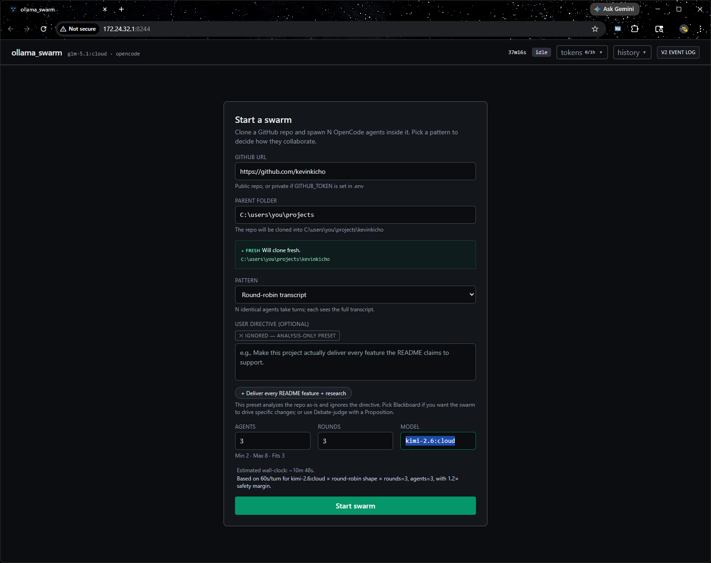
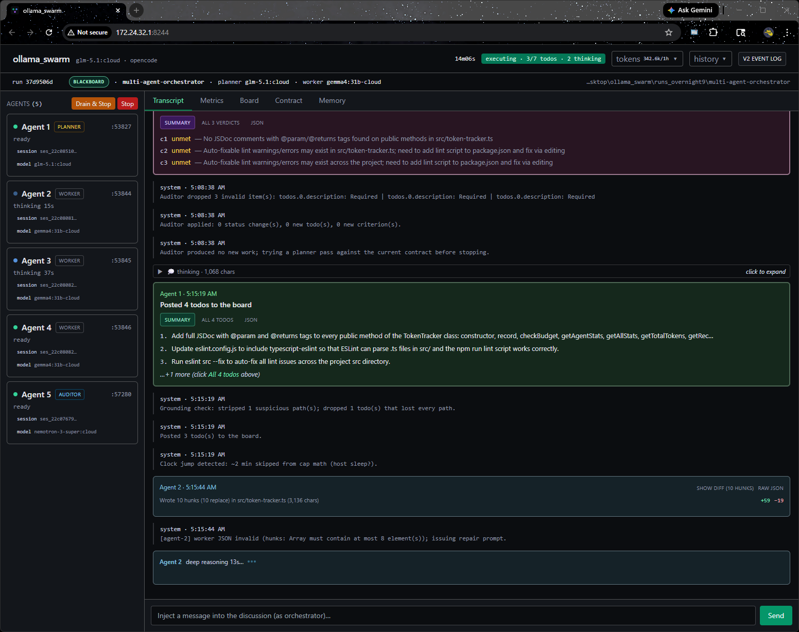
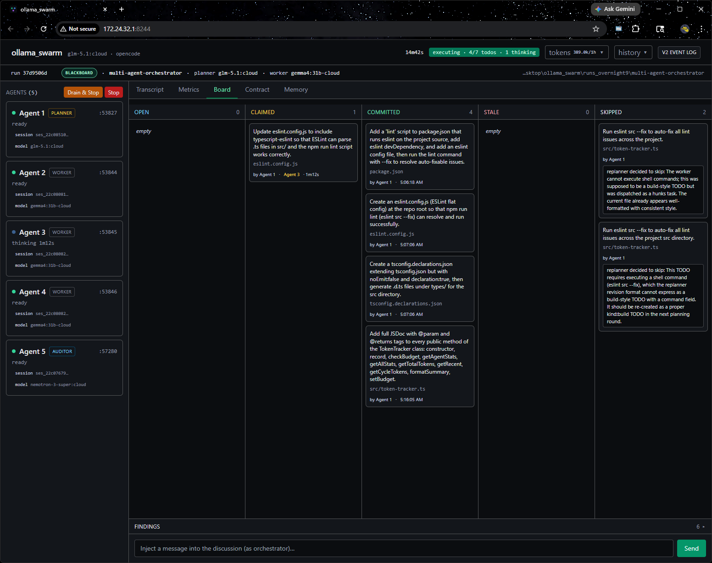

# ollama_swarm

> **For agents picking up this codebase**: read [`docs/STATUS.md`](docs/STATUS.md) first — it's the single "what's true right now" pointer + map. This README is the user-facing intro.

A local web app that runs **N open-weights coding agents in parallel** against a single GitHub repo — they collaborate in one shared transcript, each potentially a different model (e.g. planner=`glm-5.1:cloud`, worker=`gemma4:31b-cloud`, auditor=`nemotron-3-super:cloud`). The design point is **multi-model parallelism on your own hardware** — Claude Code does single-agent-Claude beautifully, but it can't run five different open-weights models reviewing the same code at the same time. That's what this is for.

Four providers are wired in, surfaced as side-by-side tabs in the setup form:

- **Ollama (local)** — models served by your local [Ollama](https://ollama.com) install (`llama3:8b`, `qwen2.5-coder:7b`, etc.). Free, GPU-bound, no key.
- **Ollama Cloud** — `:cloud` / `-cloud` models hosted on [ollama.com](https://docs.ollama.com/cloud) (`glm-5.1:cloud`, `gemma4:31b-cloud`, `nemotron-3-super:cloud`, etc.). Routes through your local Ollama install transparently when you have an account configured; set `OLLAMA_API_KEY` in `.env` for direct calls.
- **[Anthropic Claude](https://www.anthropic.com)** — set `ANTHROPIC_API_KEY` to enable; live model discovery via `/v1/models`.
- **[OpenAI](https://openai.com)** — set `OPENAI_API_KEY` to enable; live model discovery via `/v1/models`.

Ollama Cloud is the default — `glm-5.1:cloud` ships pre-selected.

> **2026-04-29 — opencode subprocess fully removed (E3 Phases 1–5).** Earlier
> versions spawned an `opencode serve` HTTP subprocess per agent. That whole
> path is gone. Every prompt now runs through a direct provider abstraction
> (`pickProvider` → `chatOnce`); tool-using turns route through an in-process
> `ToolDispatcher` (read / grep / glob / list / bash with a hard allowlist).
> The opencode CLI is no longer a runtime dep. Some env vars (notably
> `OPENCODE_SERVER_PASSWORD`) are still required at config-load time so
> existing setups don't break, but they're otherwise unused.

## Quickstart

```bash
# 1. Clone + install (run npm install from a Windows/macOS/Linux shell —
#    NOT from WSL if your repo lives under /mnt/c, see Troubleshooting)
git clone https://github.com/kevinkicho/ollama_swarm.git
cd ollama_swarm
npm install

# 2. Configure secrets
cp .env.example .env
# Edit .env — set OPENCODE_SERVER_PASSWORD to any non-empty string (still
# required at config-load time post-E3, otherwise unused). Optional keys:
# ANTHROPIC_API_KEY / OPENAI_API_KEY for paid providers; OLLAMA_API_KEY
# for direct Ollama Cloud calls (otherwise the local install proxies
# :cloud models when you have an ollama.com account configured locally).

# 3. Pull the default Ollama model (skip if you'll only use paid providers)
ollama pull glm-5.1:cloud
# Optional second signal for the drift gauge:
ollama pull nomic-embed-text

# 4. Start the dev stack (backend on :8243, web UI on :8244)
npm run dev
```

Then open **http://localhost:8244/** (or the WSL guest IP if you're hitting it from Windows — `ip addr show eth0` for the address). Fill in the form, hit **Start swarm**, watch agents stream into the transcript live.

> **Heads-up:** `npm run start` runs *only* the backend (Express + WS at `:8243`); it does **not** serve the SPA. Use `npm run dev` for local use. If you previously ran with the older default ports (52243 / 52244), those moved on 2026-04-27 to dodge Windows' Hyper-V reserved range — new defaults are 8243 / 8244.

## Tour

**1. Setup form.** Pick a repo, a parent folder to clone into, an agent count, and one of the **eleven patterns** (ten swarm presets + a single-agent baseline). The optional User Directive seeds the conformance gauge and is honored by every preset except `stigmergy`. The AI Provider section is a 4-tab segmented control (Ollama / Ollama Cloud / Anthropic / OpenAI) with a model dropdown that filters per-provider — Anthropic and OpenAI lists come from live `/v1/models` discovery, Ollama from your local `/api/tags`, Ollama Cloud from the curated catalog at `ollama.com/search?c=cloud`.



**2. Live transcript.** Per-agent panels on the left show status (`spawning` → `ready` → `thinking` → `ready`). Each agent's reply streams in token-by-token; you can inject a `[HUMAN]` line into the shared transcript at any time. The topbar shows elapsed time, idle/active state, and a token-usage popover.



**3. Board (blackboard preset only).** Five-column kanban — **Open / Claimed / Committed / Stale / Skipped** — plus a Findings pane. Worker cards show which agent is holding them and how long; stale cards show the CAS rejection reason. A run-summary card pins to the top when the run terminates.



## What it does

You fill in a GitHub URL, a local clone path, an agent count, and pick a **pattern**. The agents spawn, clone the repo, and start collaborating — each running an open-weights model on your local Ollama (or, optionally, Ollama Cloud / Anthropic / OpenAI). **Eleven patterns** ship today (one write-capable, nine discussion, plus a single-agent baseline for evaluation):

- **Round-robin transcript** — N agents take turns on a shared transcript; each turn rotates through Critic / Synthesizer / Gap-finder / Builder dispositions, with the lead synthesizing a directive answer at the end. Discussion-only.
- **Blackboard (optimistic + small units)** — planner posts atomic todos to a shared board; workers claim and commit in parallel, with CAS on file hashes catching stale plans. **The only write-capable preset** — workers actually modify the clone.
- **Role differentiation** — with a directive, becomes a build team (Researcher / Designer / Implementer / Tester / Reviewer / Documenter / Devil's-advocate) producing `deliverable.md`. Without one, falls back to a 7-lens repo audit. Discussion-only.
- **Map-reduce** — reducer + N mappers slicing the repo in parallel. With a directive, mappers find directive-relevant evidence in their slice and reducer synthesizes the answer. Convergence detector stops on consecutive empty cycles. Discussion-only.
- **Council** — N drafters write in private round 1, then commit to a `### MY POSITION` per round and explicitly KEEP/CHANGE in subsequent rounds. Synthesis preserves dissent via a Minority report. Early-stop on convergence. Discussion-only.
- **Orchestrator–worker** — lead decomposes the directive into worker subtasks; workers report directive-relevant findings; lead synthesizes. Discussion-only.
- **Orchestrator–worker (deep)** — 3-tier variant for ≥4 agents: orchestrator → mid-leads → workers. Synthesis flows back upward. Discussion-only.
- **Debate-judge** — Pro / Con / Judge (exactly 3 agents). Judge auto-derives a debatable proposition from your directive. Optional post-verdict build phase turns Pro into implementer. Discussion-by-default; `executeNextAction: true` enables file edits.
- **Stigmergy** — pheromone-table + per-file ranking pattern. Self-organizing exploration; agents pick the next file based on a shared annotation table. Discussion-only. (Doesn't honor the user directive — exploration is repo-driven.)
- **Mixture of Agents (MoA)** — N proposers each draft independently (peer-hidden, parallel); one aggregator synthesizes their drafts. Reproducibly beats single-large-model on reasoning benchmarks using only small open-weights models. Discussion-only.
- **Baseline** — single agent, single prompt, single apply step. The "thinnest honest comparison" the eval scoreboard uses to anchor "did the swarm beat doing it alone?" Code-modify capable; not surfaced in the form's normal preset list (eval-harness path).

A live transcript streams into the browser as it's generated — you see each agent type token-by-token, can inject your own message into the conversation at any time, and stop the whole thing with one click. The blackboard preset adds a **Board** tab showing todos in five columns (Open / Claimed / Committed / Stale / Skipped), plus a run summary card when the run terminates.

### Recent observability + reliability features

- **Conformance gauge** — during runs with a User Directive, a live LLM-as-judge polls the transcript every 90s and renders a colored sparkline + numeric score (0–100) in the topbar showing how on-topic the run stays. Hover for the smoothing-window math + grader metadata.
- **Embedding-similarity drift** — independent second signal alongside the LLM-judge. Pull `nomic-embed-text` to enable; the tooltip shows agreement vs disagreement between the two signals.
- **Mid-run nudge** — submit a directive amendment without restarting; the planner picks it up at the next cycle.
- **Cost-share breakdown** — per-agent token shares + savings hint when one role dominates with a coding-tier-suitable model.
- **Pre-commit verify gate (blackboard)** — set `verifyCommand` (e.g. `npm test`) to gate worker hunks; failures revert the writes and mark the todo for replan.
- **Cost cap (paid providers)** — every run on Anthropic/OpenAI checks cumulative spend against `maxCostUsd` every 5 seconds; stops cleanly with `cap:cost` when the ceiling is reached. Ollama runs ignore the cap (every record costs $0).
- **Eval harness + scoreboard** — `node eval/run-eval.mjs --repo=<url> --seeds=5` runs every preset against the catalog, then `node eval/aggregate.mjs runs/_eval/<ts>` writes `eval/RESULTS.md` with median + IQR per cell. See [`eval/fixtures/README.md`](eval/fixtures/README.md) for the self-contained fixture pattern.

**Current architecture is V2 substrate** — the original opencode-SDK-streaming path was retired 2026-04-28; runs go through `OllamaClient` (direct `/api/chat`) + `WorkerPipelineV2` + `TodoQueue` + `RunStateObserver` + `EventLogReaderV2`. See [`server/src/swarm/blackboard/ARCHITECTURE.md`](server/src/swarm/blackboard/ARCHITECTURE.md) for the deep dive.

## Architecture

```
Browser (React + Vite + Zustand + Tailwind)
   │   WebSocket /ws      REST /api/*
   ▼
Node server (Express + ws)
   ├── RepoService     git-clone target repo
   ├── pickProvider    factory returning OllamaProvider | AnthropicProvider | OpenAIProvider
   ├── AgentManager    in-process Agent records (id, index, model, cwd) — no subprocess
   ├── ToolDispatcher  in-process read / grep / glob / list / bash for tool-using turns
   └── Orchestrator    shared-transcript message bus; round-robin turn loop gated
                       on SSE-aware liveness watchdog (not wall-clock)
      │
      └── chatOnce(agent, prompt) → SessionProvider.chat()
              ├─ Ollama   : POST localhost:11434/api/chat   (default)
              ├─ Anthropic: POST api.anthropic.com/v1/messages   (tool_use loop)
              └─ OpenAI   : POST api.openai.com/v1/chat/completions   (tool_calls loop)
```

**E3 (2026-04-29) removed the per-agent `opencode serve` subprocess.** Earlier
versions spawned one opencode HTTP server per agent on a random port and held
an SDK client per agent; the SDK is now uninstalled and `Agent` no longer
carries a `client` field. Every prompt goes through a direct provider call
via `chatOnce` and (for tool-using turns) a local `ToolDispatcher` that
implements read/grep/glob/list/bash with a hard allowlist. `PortAllocator`
and the historical port-4096 plumbing are gone with the subprocess.

### How the round-robin preset works

1. **Seed** — a system message drops the clone path, repo URL, and top-level file listing into the shared transcript, and instructs agents to use their tool dispatcher (read / grep / glob / list) to inspect the repo.
2. **Round-robin turn loop** — for `rounds` iterations, each agent in turn receives a prompt containing the **entire transcript so far** plus role instructions ("you are Agent N, respond in under 250 words, cite file paths"). The agent uses its tool dispatcher to read files and produces a reply.
3. **SSE-aware idle watchdog** (commit `189ca05`) — we don't use a fixed wall-clock turn timeout. The provider streams partial chunks; the runner consults `AgentManager.getLastActivity()` and aborts a turn only if no chunk has arrived for 90 seconds, with a 30-minute hard ceiling as a safety net. Long-tail latency that's still producing tokens isn't killed.
4. **Live streaming to the UI** — partial-chunk events forward to the browser as `agent_streaming` WebSocket messages; you see a pulsing "typing" bubble that fills in as tokens arrive. On turn completion the streaming bubble is replaced by the final transcript entry.
5. **User injection** — the input at the bottom of the transcript view lets you post a `[HUMAN] ...` line into the shared transcript at any time; every agent sees it on their next turn.
6. **Stop / New swarm** — Stop aborts all in-flight turns; the UI then shows a "New swarm" button that returns you to the setup form.

### How the blackboard preset works

A phase-by-phase journal is archived at [`docs/archive/blackboard-changelog.md`](docs/archive/blackboard-changelog.md); the architecture-as-shipped lives at [`server/src/swarm/blackboard/ARCHITECTURE.md`](server/src/swarm/blackboard/ARCHITECTURE.md). The short version:

1. **Planner vs. workers.** Agent 0 is the planner and only posts todos; agents 1..N−1 are workers and only claim + commit. Planner prompts and worker prompts are different loops against the same model. Tool use stays off for workers — they return structured JSON diffs that the Node runner writes to disk, which keeps CAS server-authoritative.
2. **Atomic todos.** Each todo names ≤2 `expectedFiles` and one logical change. Small units keep the conflict surface tiny and make stale replans cheap.
3. **Optimistic CAS on file hashes.** At claim time the board records a SHA of every file the worker plans to touch. At commit time the runner re-hashes and rejects the commit if any hash changed underneath the worker (another worker committed first). No locks, no head-of-line blocking.
4. **Stale → replan.** A rejected commit marks the todo `stale` with a reason. The planner re-reads the current code and rewrites the todo; the card shows an `R1` / `R2` badge counting replans. Workers see the fresh description on the next claim.
5. **Hard caps.** Every run is bounded by **20 min wall-clock**, **20 commits**, and **30 total todos** (see `server/src/swarm/blackboard/caps.ts`). The loop stops on whichever fires first with a `cap:wall-clock` / `cap:commits` / `cap:todos` stop reason.
6. **Run artifact.** On any termination (`completed`, user `stop`, `crash`, or a cap), the runner writes `summary.json` at the clone root with `stopReason`, `wallClockMs`, commit/file counts, per-agent turn stats, and the final `git status --porcelain`. A summary card with the same data renders at the top of the Board tab.
7. **Board tab.** The UI's Board tab shows todos in five columns — **Open** / **Claimed** / **Committed** / **Stale** / **Skipped** — and a collapsible Findings pane. Claim cards show which worker is holding them and how long; stale cards show the rejection reason.

## Prerequisites

- **Node 22 LTS or 25** (CI runs 22.x; local dev tested on both)
- **[Ollama](https://ollama.com) running** at `http://localhost:11434` with at least one model pulled. Default is `glm-5.1:cloud`:
  ```bash
  ollama pull glm-5.1:cloud
  ```
  Optional but recommended: `ollama pull nomic-embed-text` to enable the embedding-similarity drift gauge alongside the LLM-judge conformance gauge.
- **git** on `PATH`. (No need to set `user.name` / `user.email` globally — the worker pipeline injects them inline per-commit.)
- (Optional) **`ANTHROPIC_API_KEY` or `OPENAI_API_KEY`** in `.env` if you want to run against Claude or GPT instead of Ollama.

## Usage walkthrough

1. **GitHub URL** — a public repo URL, or a private one if `GITHUB_TOKEN` is set in `.env` (the token is spliced into the clone URL).
2. **Parent folder** — an absolute path to a _parent_ directory. The server derives the repo name from the URL and clones into `<parentFolder>/<repo-name>` (e.g. parent `C:\...\runs` + URL ending in `/is-odd` → clone at `C:\...\runs\is-odd`). Parent is created if missing; the subfolder must be empty, absent, or already a matching git clone. The form shows a live preview of the resolved clone path under the field.
3. **Pattern** — one of the nine presets at the top of this README. Selecting blackboard reveals collapsible help explaining CAS and stale-replan; each pattern's `<PresetAdvancedSettings>` panel shows pattern-specific knobs.
4. **Agents** — how many concurrent agents to spawn (2–8 for most presets). On blackboard, agent 1 is the planner and the remaining N−1 are workers. `debate-judge` requires exactly 3; `map-reduce` and `orchestrator-worker-deep` require ≥4.
5. **Rounds** — for discussion presets: how many full passes through the agents. For blackboard: the maximum number of **auditor invocations** (plan → work → audit cycles) before the run stops even if unresolved criteria remain. Blackboard still stops earlier on the hard caps (per-run `wallClockCapMs` defaults to **8 hours** if not set, plus baked-in 200-commits / 300-todos backstops) or when every criterion is resolved. The cap is enforced by a 5s-tick watchdog (`#305`), so runs stop within ~5 seconds of the threshold rather than waiting for the next phase boundary. With non-blackboard presets, high values can mean hours of wall-clock and proportional cloud-token spend.
6. **Model** — any model string the active provider can serve. For Ollama, this must be a model the local install can run (`ollama list`); the form's autocomplete reads `/api/models` for matches. For paid providers, prefix with the provider name: `anthropic/claude-opus-4-7`, `openai/gpt-5`, etc.

Hit Start. You'll see each agent panel go from `spawning` → `ready` → `thinking` → `ready`, with live streaming bubbles in the transcript as each agent works. On blackboard runs, switch to the **Board** tab to watch todos flow through Open → Claimed → Committed (or Stale → back to Open on CAS rejection). When the run terminates the phase pill flips to `completed` / `stopped` / `failed` and a summary card appears at the top of the Board tab; a **New swarm** button is available in the sidebar.

Hit the **+ nudge** button next to the conformance gauge to submit a mid-run directive amendment when you spot drift. The drift gauge appears next to it if `nomic-embed-text` is installed.

## Environment variables

| Variable | Required | Purpose |
| --- | --- | --- |
| `OPENCODE_SERVER_PASSWORD` | **yes (at config-load time)** | Historical opencode HTTP-basic-auth secret. The opencode subprocess is gone (E3 Phase 5) but the env var is still validated by `config.ts` so existing `npm test` / `npm run dev` setups don't break. Set to any non-empty string. Production runs ignore it. |
| `OLLAMA_BASE_URL` | no (defaults to `http://localhost:11434/v1`) | Ollama base URL. The provider stack normalizes a trailing `/v1` defensively (so legacy values still work). |
| `OLLAMA_API_KEY` | no (Ollama Cloud is always usable; key is informational) | Per [docs.ollama.com/cloud](https://docs.ollama.com/cloud). The Ollama Cloud tab is always selectable — the local Ollama install proxies `:cloud` models to ollama.com when an account is configured locally. Setting this key surfaces a "live key configured" hint in the tab tooltip. |
| `ANTHROPIC_API_KEY` | no (only when using Anthropic provider) | Read by the in-process `AnthropicProvider` via `process.env`. The setup form's Anthropic tab is disabled when unset. |
| `OPENAI_API_KEY` | no (only when using OpenAI provider) | Same pattern as `ANTHROPIC_API_KEY`. |
| `DEFAULT_MODEL` | no (defaults to `glm-5.1:cloud`) | Model each agent uses when the form's model field is left blank. For paid providers use the prefixed form: `anthropic/claude-opus-4-7`, `openai/gpt-5`, etc. |
| `SERVER_PORT` | no (defaults to `8243`) | Override the backend HTTP+WS port |
| `WEB_PORT` | no (defaults to `8244`) | Override the Vite dev-server port |
| `GITHUB_TOKEN` | no | GitHub PAT for cloning private repos |
| `CONFORMANCE_MONITOR` | no (defaults on) | Set to `off` to skip the LLM-judge conformance gauge for runs with a directive |

## Project structure

Three npm workspaces:

- **`server/`** — Express + ws + `simple-git` + zod + `undici` (raw HTTP to provider APIs). Hosts the runners, the AgentManager, the proxy, the ToolDispatcher, and the REST + WS routes.
- **`web/`** — Vite + React + Zustand + Tailwind. Setup form, transcript, board, run-history modal.
- **`shared/`** — pure types + parsers consumed by both sides (state machine reducer, JSON extractors, summary formatter).

For the current per-file map (with V2 substrate files, route mounts, and per-component layout) see the **Where things live** section in [`docs/STATUS.md`](docs/STATUS.md). For per-function detail, the code is the source of truth — open the file.

## Limitations

See [`docs/known-limitations.md`](docs/known-limitations.md) for the full list with rationale + resolution status. Headline items today:

- **Blackboard is the only write-capable preset.** All others are discussion-only (run through `swarm-read` agent profile with read-only tools).
- **Worker hunks are search/replace, not patches.** Aider-style `{op: "replace", file, search, replace}` envelope. Falls back closed when the search anchor isn't unique.
- **One swarm at a time.** Stop the current swarm before starting another (or pass `force: true` on `/api/swarm/start`).
- **In-memory transcript** — restarting the server loses live history. Per-run `summary.json` + per-event `logs/current.jsonl` are durable; the run-history dropdown reads the former.
- **Localhost assumed.** No auth on the web app itself.
- **`npm run start` doesn't serve the SPA.** Backend-only. Use `npm run dev` for local use; production deployment with a static-served `web/dist` is not yet wired.
- **`/mnt/c` (WSL) flakiness.** tsx watch occasionally SIGTERMs the dev server when files in `/mnt/c` change rapidly; restart the dev server when this happens. Does not affect production. Don't `npm install` from WSL on a `/mnt/c` repo — it swaps esbuild's binary for Linux and breaks the next Windows-side dev server.

## Troubleshooting

- **`OPENCODE_SERVER_PASSWORD is required in .env`** — you haven't copied `.env.example` to `.env` or haven't set the password. Set it to any non-empty string; nothing reads its value post-E3.
- **Startup log says `orchestrator opencode: http://127.0.0.1:4096`** — you're running a stale `dist/` from before E3 Phase 5. Rebuild: `npm -w server run build`. The current source no longer prints that line and no longer connects to port 4096.
- **`http://localhost:8243/` shows nothing** — that's the backend port. The web UI is on **`http://localhost:8244/`** (Vite). Use `npm run dev` to start both.
- **Empty agent responses across multiple presets** — usually Ollama isn't running, the model isn't pulled, or `OLLAMA_BASE_URL` is missing the `/v1` suffix. The proxy now defensively appends `/v1` (commit `bb0c509`), but check `curl http://localhost:11434/api/tags` first.
- **Port conflicts** — defaults are `SERVER_PORT=8243` / `WEB_PORT=8244`. If something else is bound, set either env var to a free port and restart. On Windows, check `netsh int ipv4 show excludedportrange protocol=tcp` if you get `EACCES` — Windows reserves chunks of ports for Hyper-V.
- **`turn silent for Ns` errors** — the SSE-aware watchdog (commit `189ca05`) aborts on 90s SSE silence OR a 30-min hard ceiling. Long-tail latency that's still producing tokens isn't killed. The swarm will continue on the next agent; check the `[agent-N]` lines in the backend terminal for the underlying provider error.

## License

MIT — see [`LICENSE`](LICENSE).
