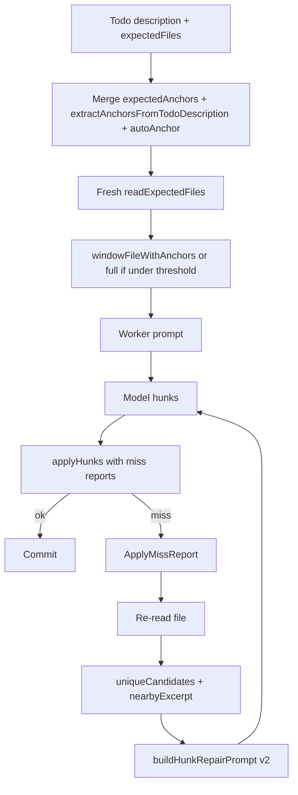
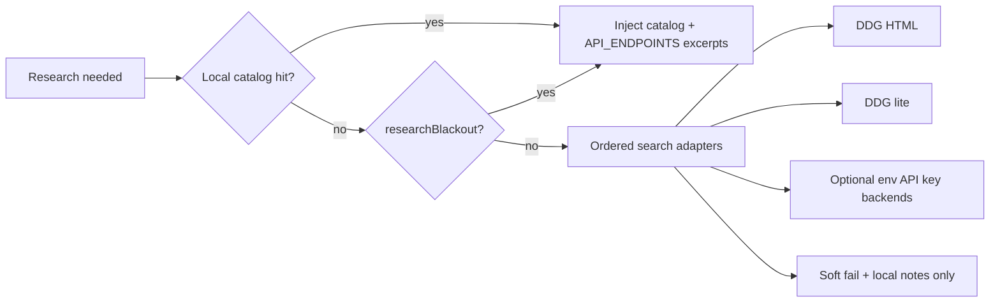

# Worker Grounding, Anchor Apply, and Research Resilience

| Field | Value |
|-------|-------|
| **Author** | Design for postmortem follow-through |
| **Date** | 2026-07-16 |
| **Revision** | 1 |
| **Status** | Proposed — ready for `/execute-plan` |
| **Related runs** | `eee6718f-03f3-45dd-a3a2-593076734102`, `9f449937-a060-49e6-9417-aba2774dfb16` |
| **Related code** | `applyHunks.ts`, `windowFile.ts`, `autoAnchor.ts`, `worker.ts` prompts, `webTools.ts`, `researchPolicy.ts`, `councilWorkerRunner.ts`, `buildHunkRepairPrompt` |
| **Already shipped (do not re-do)** | Stream loop abort/collapse, finalizeAgentOutput, research policy gate, literature false-positive fix (`isLiteratureTodo`), literature blackout/cache, think-aware `formatExpect` JSON sniff |

---

## Overview

Runs `9f449937` and `eee6718f` closed the **stream balloon** and **false literature thrash** classes. Remaining permanent / high-cost worker failures are **disk-grounded** and **research-backend** problems:

1. **Search-anchor misses** — `op:"replace"` / `replace_between` with `search`/`start` text not present in the live file (stale prompt excerpt or invented anchors).
2. **Non-unique `replace_between` / `replace`** — `start` or `search` matches 2+ times; apply fails closed (correct) but recovery is weak.
3. **True literature still broken when needed** — DDG HTML 403; blackout correctly stops thrash, but there is no alternate free backend and no strong **local-first API catalog** path for panel/endpoint work.

This design turns those into **incremental, reviewable PRs** with clear ownership, tests, and success metrics — not more detectors that only log the same failure.

---

## Background & Motivation (verified)

### Run `eee6718f` (council, 3 agents, ~36 min, user stop)

| Signal | Count / value |
|--------|----------------|
| Files changed | 48 |
| ✓ applied commits | 47 |
| Literature tool-loop fails | ~20 (mostly false-positive todos — **fixed in `5248497`**) |
| Primary JSON parse (`<think>…`) | 12 (**format sniff wired in `5248497`**) |
| Search not found / non-unique | ~4 hard apply fails in transcript |
| Cycle fail rates | 36% → 35% → 19% → 20% (improves as files stabilize) |
| Peak agent text | ~8.7k (stream integrity OK) |

### Failure classes still open after `5248497`

```text
PRIMARY FAIL BUCKETS (eee6718f, remaining after shipped fixes)
├── search_not_found / start_not_found     ← PR-A, PR-B
├── start/search matches N times           ← PR-B
├── worker returned no hunks               ← partially helped by format sniff; PR-A improves prompts
└── true literature when needed + DDG 403  ← PR-C, PR-D
```

### Existing partial infrastructure

| Piece | Gap |
|-------|-----|
| `windowFileWithAnchors` + `extractAnchorsFromTodoDescription` | Anchors often missing or wrong; miss report not fed into repair |
| `applyHunks` trailing-whitespace normalize + suffix unique-shorten for `replace` | **`replace_between` has no multi-match recovery**; no fuzzy whitespace for `start` |
| `buildHunkRepairPrompt` | Called on search miss, but often re-prompts without re-reading file or suggesting unique substrings |
| `researchPolicy` + literature blackout | Stops thrash; does not provide **working** search or local catalog when research is legitimate |
| `GOVERNMENT_API_CATALOG.md` / `docs/API_ENDPOINTS.md` seed | Present for planner; **not injected into literature fail / worker repair paths** |

---

## Goals & Non-Goals

### Goals

1. **Raise apply success rate** on replace / replace_between without weakening fail-closed safety (no multi-match silent apply).
2. **Ground every repair** on a **fresh disk read** + structured miss report (nearby lines, unique candidate anchors).
3. **Local-first research path** for panel/endpoint todos when web search is down or blacked out.
4. **Pluggable search backends** for true literature (no single DDG dependency).
5. **Measurable** via transcript reason buckets + optional `streamIntegrity`-style summary field for apply/repair stats.

### Non-Goals

1. Guaranteeing 0% cycle fail rate (model will still invent bad hunks).
2. Paid search APIs as the default (optional env keys only).
3. Full fuzzy diff3 / AST patching (out of scope for v1; exact-string hunks remain).
4. Re-opening stream-loop / formatExpect work already on `main`.

---

## Key Decisions

| # | Decision | Rationale |
|---|----------|-----------|
| D1 | **Structured `ApplyMissReport` at apply time** | Callers (council, wrap-up, blackboard) share one repair payload; no more free-text-only reasons. |
| D2 | **`replace_between` uniqueness = start unique in file; end first-after-start** | Matches current semantics; recovery expands `start` with surrounding lines rather than picking arbitrary match. |
| D3 | **One disk re-read + deterministic candidate anchors before LLM repair** | Cheap; prevents repair prompts that re-use stale windowed excerpts. |
| D4 | **Research = local catalog first, web second** | Panel work almost never needs DDG; official URLs live in repo docs. |
| D5 | **Search backends as ordered adapters** | DDG HTML → DDG lite (already) → optional Brave/Serper/Bing if key → **local endpoint index** always available. |
| D6 | **PR stack is bottom-up: types/report → apply → repair wiring → research** | Repair UI/prompts depend on ApplyMissReport; research is independent after PR-A groundwork. |

---

## Proposed Design

### A. Apply miss report (shared contract)

```typescript
// shared or server/src/swarm/blackboard/applyMissReport.ts
export type ApplyMissKind =
  | "search_not_found"
  | "search_not_unique"
  | "start_not_found"
  | "start_not_unique"
  | "end_not_found"
  | "other";

export interface ApplyMissReport {
  file: string;
  hunkIndex: number;
  op: string;
  kind: ApplyMissKind;
  /** Snippet model used (truncated). */
  needle: string;
  matchCount: number;
  /** ±N lines around best guess / first match / file head. */
  nearbyExcerpt: string;
  /** Deterministic unique substrings of needle that appear once in file (if any). */
  uniqueCandidates: string[];
  /** Human one-liner for transcript (compatible with today's messages). */
  message: string;
}
```

`applyFileHunks` / `applyHunks` either:

- **Option 1 (preferred):** return `{ ok: false, error: string, miss?: ApplyMissReport }` (back-compat: `error` stays parseable; `miss` is additive), or  
- **Option 2:** keep string error; add `parseApplyError(error, fileText) → ApplyMissReport | null` pure helper used by repair.

**Chosen: Option 1** — miss data at source is more accurate (counts, candidates computed while file is in hand).

### B. Anchor grounding pipeline (before emit + on repair)



**Improvements vs today**

1. **Always re-read** before repair (council already re-reads in `tryWorkerPrompt`; ensure repair path uses **miss.nearbyExcerpt from post-fail file**, not pre-prompt window only).
2. **Candidate generation (deterministic, no LLM):**
   - For `search_not_found`: longest line prefixes/suffixes of needle that appear exactly once (extend existing `replace` multi-match shortening to **not-found** case: try unique **sublines**).
   - For `start_not_unique`: expand `start` by adding N lines of file context above/below first match until unique (max N=5); if still not unique, list line numbers of all matches in report.
3. **`replace_between` parity:** apply same trailing-trim normalize on `start` / `endExclusive` as `replace` does for `search`.

### C. Research resilience



**Local catalog index (PR-D)**

- Build a tiny in-memory index at run start (or lazy): scan `docs/API_ENDPOINTS.md`, `GOVERNMENT_API_CATALOG.md`, `docs/PANELS.md` for URLs and route names.
- On literature trigger **or** blackout: inject top-K snippets matching todo keywords (FRED, BIS, OECD, etc.).
- This is the primary path for **panel work**; web is optional enrichment.

**Search adapters (PR-C)**

- Interface: `SearchAdapter { id; search(query): Promise<SearchLink[]> }`
- Registry order: existing DDG HTML, DDG lite, then if `BRAVE_API_KEY` / `SERPER_API_KEY` / `BING_SEARCH_KEY` set, use that.
- No new paid dependency required for merge; keys optional.
- Rate-limit and fail-closed to local catalog after N adapter failures (align with blackout).

### D. Observability

Add optional `applyIntegrity` on run summary (mirror `streamIntegrity`):

```typescript
applyIntegrity?: {
  attempts: number;
  applied: number;
  missByKind: Record<string, number>;
  repairSuccesses: number;
  repairFailures: number;
};
```

Populate from council + blackboard apply paths via a small counter on adapter state / runner.

---

## Alternatives considered

| Alternative | Why rejected |
|-------------|--------------|
| Always full-file in worker prompt | Token blow-up on large files; already have anchors |
| Soft multi-match apply (first match wins) | Silent wrong edit risk |
| Only more detectors / stuck messages | Already solved thrash; need successful apply/research |
| Require paid search | Breaks free/default product |

---

## Risks & Mitigations

| Risk | Mitigation |
|------|------------|
| Candidate substrings too short → wrong unique match | Min length 20–40 chars; prefer multi-line candidates |
| `ApplyMissReport` breaks string-only callers | Keep `error` string; `miss` optional |
| Catalog index stale | Rebuild each run from clone disk |
| format sniff + ollamaFormat double-abort | Already separate; this plan does not change sniff thresholds |

---

## Success metrics (post-merge runs)

1. **Search not found** primary fails drop ≥50% vs eee6718f baseline on similar panel workloads.
2. **Literature messages** only appear for explicit research todos; blackout rare.
3. When web down, worker prompts still contain **at least one** catalog URL/snippet for gov/panel todos.
4. Unit tests for apply miss kinds + candidate generation; adapter tests with mocked fetch.

---

## Open Questions (resolved defaults)

| Question | Default for implementation |
|----------|----------------------------|
| Paid search required? | No — optional env only |
| Min unique candidate length | 32 chars |
| Repair max re-tries | Keep existing stage 2 + 3; improve payload quality only |
| Catalog files | `docs/API_ENDPOINTS.md`, `GOVERNMENT_API_CATALOG.md`, `docs/PANELS.md` if present |

---

## PR Plan

Dependency order (linear stack for plain-git / Graphite):

```text
PR1 ──► PR2 ──► PR3
  │               │
  └───────────────┴──► PR4 ──► PR5
```

Independent after PR1: PR4 can start once PR1 lands if PR2 is delayed; prefer full stack order.

### PR 1 — ApplyMissReport + replace_between normalize

**Title:** `feat(apply): structured apply miss reports and replace_between normalize`

**Files:**
- `server/src/swarm/blackboard/applyHunks.ts`
- `server/src/swarm/blackboard/applyHunks.test.ts` (or new `applyMissReport.test.ts`)
- Optional: `server/src/swarm/blackboard/applyMissReport.ts` types

**Description:**
- Extend apply failure path with `ApplyMissReport` (kind, needle, matchCount, nearbyExcerpt, uniqueCandidates).
- Port trailing-trim normalize to `replace_between` start/endExclusive.
- Preserve existing human-readable `error` strings for transcript compatibility.
- Unit tests for: not found, not unique, uniqueCandidates, normalize CRLF/trailing space.

**Depends on:** none  

**Success:** tests green; no behavior change when apply succeeds.

---

### PR 2 — Deterministic unique-candidate recovery helpers

**Title:** `feat(apply): unique substring and expand-start candidates for repair`

**Files:**
- `server/src/swarm/blackboard/applyMissReport.ts` (or helpers in `applyHunks.ts`)
- Tests

**Description:**
- Pure functions: `findUniqueSubstrings(needle, fileText)`, `expandToUnique(start, fileText, maxExpandLines)`.
- Used by apply path when count≠1 and by repair prompt builders.
- Document min length and max expand.

**Depends on:** PR 1  

**Success:** unit tests cover not-found and multi-match fixtures from eee6718f-shaped strings (`panelRegistry` multi-section).

---

### PR 3 — Wire miss reports into hunk repair (council + blackboard + wrap-up)

**Title:** `feat(workers): grounded hunk repair using ApplyMissReport`

**Files:**
- `server/src/swarm/blackboard/prompts/worker.ts` (`buildHunkRepairPrompt` v2)
- `server/src/swarm/councilWorkerRunner.ts`
- `server/src/swarm/blackboard/workerRunner.ts` / parse cascade / repair call sites
- `server/src/swarm/wrapUpApplyPhase.ts` (optional: pass miss report into worker re-prompt already partially there)
- Tests: source-shape + pure prompt contains nearbyExcerpt + uniqueCandidates

**Description:**
- On apply miss, build repair prompt with: failed op, needle, nearby excerpt from **fresh** file, unique candidates as suggested `search`/`start`.
- Skip re-literature on repair (already done for council; mirror blackboard if needed).
- Transcript: keep short reason; optional `[apply-miss]` system line with kind.

**Depends on:** PR 1, PR 2  

**Success:** simulated apply miss → repair prompt includes file excerpt and at least one candidate when uniqueness allows.

---

### PR 4 — Local API/catalog grounding for workers and literature blackout

**Title:** `feat(research): local endpoint catalog index for worker grounding`

**Files:**
- New: `server/src/swarm/research/localCatalogIndex.ts` (+ tests)
- `server/src/swarm/councilWorkerRunner.ts` (literature fail / blackout inject notes)
- `server/src/swarm/blackboard/workerLiteratureResearch.ts` / worker seed
- `server/src/swarm/blackboard/prompts/worker.ts` / planner seed optional share

**Description:**
- Index clone docs for routes/URLs (API_ENDPOINTS, GOVERNMENT_API_CATALOG, PANELS).
- `lookupLocalCatalog(todoDescription, maxSnippets) → string` for prompt injection.
- Always inject on literature skip/blackout and for panel-ish todos when web tools enabled but blackout active.
- No network.

**Depends on:** none (can parallelize after PR 1 conceptually; stack after PR 3 for simpler integration)

**Success:** unit test with fixture markdown returns BIS/FRED snippets for relevant todos.

---

### PR 5 — Pluggable search backends + optional keyed APIs

**Title:** `feat(research): pluggable web_search adapters beyond DDG`

**Files:**
- `server/src/tools/webTools.ts` (refactor to adapters)
- New: `server/src/tools/searchAdapters.ts` (+ tests with mock fetch)
- `docs/AGENT-GUIDE.md` or env example for optional keys
- `researchPolicy.ts` unchanged except docs

**Description:**
- Adapter interface + ordered registry.
- Keep DDG HTML + lite; add optional Brave/Serper/Bing when env present.
- Unified error → blackout-compatible message; never invent results.
- Rate limit shared.

**Depends on:** PR 4 preferred (local fallback already in place); can land after PR 4 only  

**Success:** mock adapter order; without keys behavior = current DDG chain + local notes from PR 4.

---

### PR 6 (optional) — Apply integrity summary field

**Title:** `feat(summary): applyIntegrity stats on run summary`

**Files:**
- `summaryTypes.ts`, `buildSummary` / `buildDiscussionSummary`
- Counters on council adapter / blackboard apply path
- Web digest optional display

**Depends on:** PR 3  

**Success:** summary.json includes missByKind after a fixture run or unit assembly test.

---

## Implementation notes for `/execute-plan`

1. **Base branch:** `main` (includes stream integrity + literature fix + format sniff).
2. **Do not regress:** literature blackout, `isLiteratureTodo` strictness, `finalizeAgentOutput`, research policy preflight.
3. **Test priority:** pure apply/helpers first (PR1–2), then wiring (PR3), then research (PR4–5).
4. **Fixtures:** use strings from eee6718f-style errors:
   - `panelRegistry.js` multi-section keys
   - `marketPanels.js` replace miss
   - COMMERCIAL_PAPER naming (must not trigger literature)

---

## Out of scope reminders (already shipped)

| Item | Commit / area |
|------|----------------|
| Stream loop abort / WS / event-log caps | `1cec711` et al. |
| finalizeAgentOutput + research policy | `6efa8ef` |
| Literature false positives + blackout + JSON sniff | `5248497` |
| streamIntegrity on summary + UI ribbon | `e661536` |

---

## Acceptance checklist for the stack

- [ ] PR1–2: apply tests for miss kinds + candidates  
- [ ] PR3: repair prompt grounded; no literature re-entry on repair  
- [ ] PR4: local catalog injection when web blackout  
- [ ] PR5: optional adapters; default free path works offline for catalog  
- [ ] Manual: re-run panel-heavy council directive; literature noise near zero; apply miss rate down; true research still possible with key or catalog  

---

## Appendix: eee6718f evidence map

| Transcript pattern | Design PR |
|--------------------|-----------|
| `search text not found` / `start text not found` | PR1–3 |
| `start text matches 2 times` | PR1–2 |
| `tool loop stuck: research` on panel todos | Shipped (`isLiteratureTodo`); PR4 for when research is real |
| DDG 403 / backends unavailable | PR5 + PR4 |
| `JSON parse failed: <think>` | Shipped (format sniff) |
| Cycle 30% fail early, 20% late | Expected improvement from PR1–3 |
