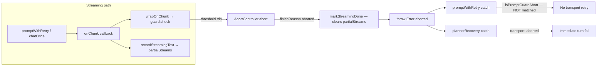
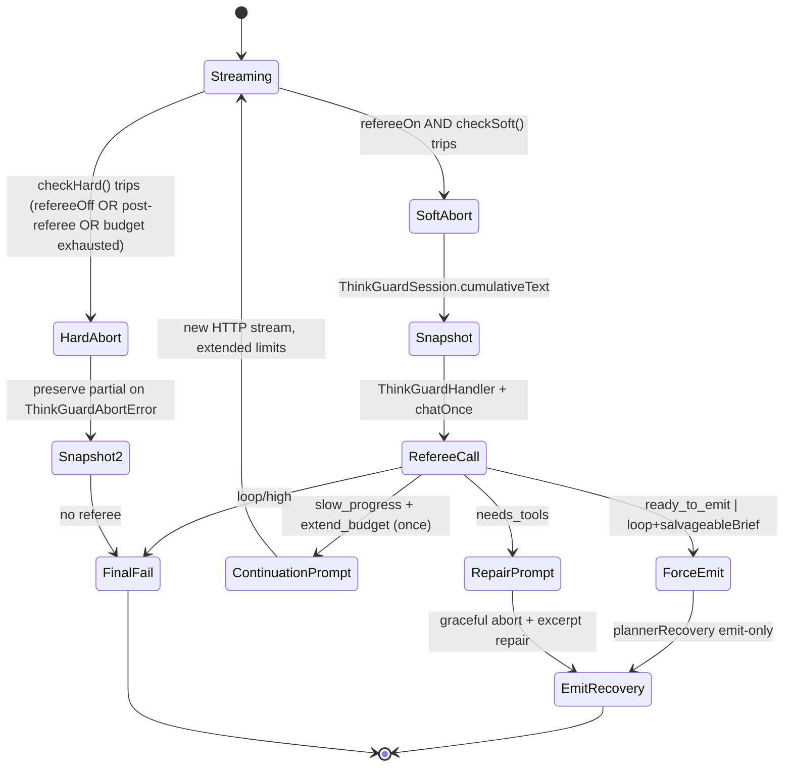
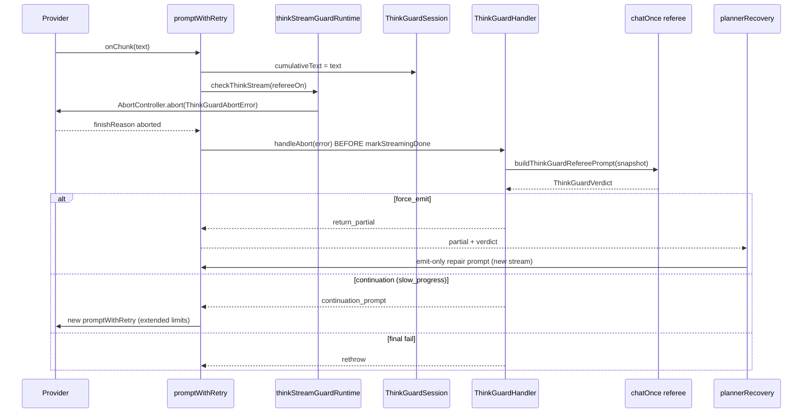

# Think-Stream Guard Referee Checkpoint

| Field | Value |
|-------|-------|
| **Author** | Design-doc-writer (systems architect) |
| **Date** | 2026-07-09 |
| **Revision** | 3 (re-review — N1–N4 addressed) |
| **Status** | Proposed |
| **Related decisions** | `docs/decisions.md` (2026-07-09: No stream guards) — **requires Phase −1 reconciliation + extension entry** |
| **Related postmortem** | `docs/postmortems/stream-guards-removed.md`, `docs/postmortems/e182490a-2026-07-09.md` |
| **Primary files** | `shared/src/streamThinkGuard.ts`, `server/src/swarm/thinkStreamGuardRuntime.ts`, `server/src/swarm/promptWithRetry.ts`, `server/src/swarm/chatOnce.ts`, `server/src/swarm/blackboard/plannerRecovery.ts`, `server/src/swarm/blackboard/promptRunner.ts` |

---

## Overview

Today, `streamThinkGuard` hard-aborts long **think-only** streams at fixed thresholds (160k chars, 120s, or repetitive tail) with **no analysis** of the partial content. On abort, `promptWithRetry` calls `markStreamingDone` (which **deletes** `partialStreams`) and throws a generic `Error("aborted")` — erasing the guard reason and partial text before recovery layers can act.

This design introduces a **two-tier guard** with **post-abort referee triage**: at the soft tier the stream aborts synchronously (matching today's `wrapOnChunk` model), but the partial snapshot is preserved on a typed `ThinkGuardAbortError`, analyzed by a cheap referee `chatOnce` call, and acted on via emit-only salvage — **without** re-running the full explore prompt.

> **Checkpoint model (chosen):** **Post-abort triage** — abort at Tier 1, referee analyzes snapshot, dispatch action. **Not** true mid-stream pause/resume (providers do not support HTTP stream resume; `wrapOnChunk` is synchronous).

---

## Phase −1 Prerequisite: Reconcile `decisions.md` with live code

**Problem:** `docs/decisions.md` (2026-07-09) states *"no guard or loop-abort wiring remains in any swarm preset"* and *"Status: Shipped (removed)"*, but the codebase **already ships** `streamThinkGuard` via `composePromptGuardSignals` on all `promptWithRetry` / `chatOnce` paths.

**Required before any referee PR merges (PR 0):**

1. Amend `docs/decisions.md` 2026-07-09 entry to document **intentional partial exception**:
   - Removed: `STREAM_GUARD_*` char caps, `intraStreamLoop`, stream-abort retry addenda, transport retry on guard abort.
   - **Retained (narrow):** `streamThinkGuard` think-only caps (160k / 120s / repetitive tail) + `isPromptGuardAbort` non-retry — no full-prompt replay.
2. Add stub for **2026-07-XX: Think-stream referee checkpoint** extension (filled in PR 8).
3. **Product-owner sign-off** on extending retained guard with referee — blocks PR 8, not PR 1–7 implementation.

---

## Background & Motivation

### Current behavior (verified in codebase)



| Component | Path | Behavior |
|-----------|------|----------|
| **Heuristic guard** | `shared/src/streamThinkGuard.ts` | `THINK_STREAM_MAX_CHARS = 160_000`, `THINK_STREAM_MAX_MS = 120_000`, `detectRepetitiveTail()` when think > 10k |
| **Runtime wrapper** | `server/src/swarm/thinkStreamGuardRuntime.ts` | `composePromptGuardSignals()` wraps `onChunk` synchronously; also applies profile wall-clock |
| **Wiring** | `promptWithRetry.ts:275`, `chatOnce.ts:115` | Every provider-streamed prompt passes through guard |
| **Partial buffer lifecycle** | `AgentManager.ts:951-966` | `recordStreamingText` on chunk; **`markStreamingDone` deletes entry** before throw (`promptWithRetry.ts:355-370`) |
| **Anti-retry** | `promptWithRetry.ts:382,424` | `isPromptGuardAbort()` blocks transport retry — but generic `"aborted"` is **not** matched |
| **Recovery gap** | `plannerRecovery.ts:195-204` | Sees `transport: aborted` → `!isRetryableSdkError` → **return fail**; no partial salvage |
| **Downstream skip** | `planningPolicy.ts:133-136` | `shouldSkipPlannerAfterContractFailure` skips planner-todos on `transport:` prefix — guard abort blocks todos phase |
| **Post-parse salvage** | `parseSalvage.ts` (`MAX_SALVAGE_SNIPPET = 6000`), `plannerRecovery.responseExcerpt` (8000) | Excerpt salvage **after** complete response parse failure — not on guard abort |

### Problem cases

1. **False positive on length** — Legitimate contract explore on large repos can exceed 160k think chars while making real progress. Hard abort wastes 80–160k output tokens; partial text is cleared before recovery.
2. **True loop still costly** — Guard fires late; turn fails with `transport: aborted`; no structured finding; `shouldSkipPlannerAfterContractFailure` may skip downstream planner work.
3. **Doc/code drift** — `decisions.md` says guards removed; `streamThinkGuard` is live. Referee extension must document narrow scope, not blind reversal.

### Existing patterns to extend

| Pattern | File(s) | Reuse for referee |
|---------|---------|-------------------|
| Auditor JSON salvage | `plannerAuditorAssist.ts`, `parseSalvage.ts` | Emit-only call, structured JSON, `assistKind` chip |
| Best-of-N judge | `bestOfNTurn.ts` | Judge prompt + strict JSON parse shape |
| Exploration cache | `shared/src/explorationCache.ts` | Partial explore → `council-shared-explore` / emit-only |

### Verified motivation runs

- **`e182490a`** (`docs/postmortems/e182490a-2026-07-09.md`) — council run with per-agent contract explore duplication (N× explore cost); long think-only phases on panel-heavy repos.
- **`4b2da092`** (`docs/postmortems/run-4b2da092.md`) — parse-salvage cascade context; long reasoning before emit failure.

---

## Goals & Non-Goals

### Goals

1. **Soft-tier abort + referee triage (when `refereeOn`)** — At ~70% of hard thresholds, abort and invoke referee on preserved snapshot — **only when flag on and activity gated**. Flag off: hard thresholds only (no regression).
2. **Structured verdict** — JSON: `loop | slow_progress | ready_to_emit | needs_tools` with confidence, rationale, optional `salvageableBrief`.
3. **Verdict-driven actions** — Force emit pass, continuation prompt (extend budget once), or final fail — **without** restarting the full explore prompt.
4. **Preserve anti-retry invariant** — `ThinkGuardAbortError` is non-retryable at transport layer (`isPromptGuardAbort`).
5. **Scoped rollout** — Feature flag **default off**; when enabled, referee applies to **`activity.kind` ∈ `{contract, planner-todos}`** with `mode === "explore"` only.
6. **Observability** — `debug.jsonl` events, transcript system lines, postmortem fields.

### Non-Goals

1. **Mid-stream pause/resume** — Not supported by providers or sync `wrapOnChunk`; rejected in favor of post-abort triage.
2. **Stream-abort retry addenda** or transport retry on guard abort.
3. **Turn-level Jaccard / intra-stream loop modules** (deleted per 2026-07-09).
4. **Referee on discussion presets** — Tier-2 hard abort only (no referee) when flag off; discussion presets never get referee even when flag on (v1).
5. **v1 compress mini-call** — Deferred; `salvageableBrief` in verdict covers compression need.

---

## Proposed Design

### Checkpoint model: post-abort triage



**Synchronous abort path (unchanged shape, new error type):**

1. `wrapOnChunk` updates `ThinkGuardSession.cumulativeText = text` on every chunk.
2. **Threshold selection (N1):** `refereeOn = refereeEligible && (RunConfig.thinkGuardRefereeEnabled ?? THINK_GUARD_REFEREE_ENABLED)`.
   - **`refereeOn === false`:** call **`checkHard` only** — preserves today's 160k / 120s / hard-tail behavior. **`checkSoft` is not invoked.**
   - **`refereeOn === true`:** call `checkSoft` first; on miss, call `checkHard`.
3. On trip: `session.lastTrip = trip`; `trip.abort(new ThinkGuardAbortError({ tier, reason, partialText: session.cumulativeText, ... }))`. `AbortSignal.reason` carries the typed error.
4. **`promptWithRetry` try branch (N2)** — dominant abort path; **not** the `catch` block:
   - After `provider.chat` returns `finishReason === "aborted"`, **before** `markStreamingDone`:
   - `const guardErr = extractThinkGuardAbortError(guardSession, guardedSignal)` — prefer `guardedSignal.reason` if `ThinkGuardAbortError`, else rebuild from `session.lastTrip` + `cumulativeText`.
   - If `guardErr && opts.thinkGuardHandler`: `action = await handler.handleAbort(guardErr)`.
   - On `return_partial`: `markStreamingDone(agentId, { preservePartial: true })`; return SDK-shaped `{ data: { parts: [{ type: "text", text }] } }` — **no** `throw new Error("aborted")`.
   - On `continuation_prompt`: return or re-invoke per handler contract (PR 3).
   - Else: `markStreamingDone(agentId)`; `throw guardErr ?? new Error("aborted")`.
5. Handler runs referee `chatOnce`; dispatches action; may return salvaged result without generic abort erasure.

### Two-tier threshold model

Constants in `shared/src/streamThinkGuard.ts` (exported for tests):

| Constant | Value | Purpose |
|----------|-------|---------|
| `THINK_STREAM_SOFT_MAX_CHARS` | `112_000` | 70% of hard cap |
| `THINK_STREAM_HARD_MAX_CHARS` | `160_000` | Unchanged |
| `THINK_STREAM_SOFT_MAX_MS` | `84_000` | 70% of 120s |
| `THINK_STREAM_HARD_MAX_MS` | `120_000` | Unchanged |
| `THINK_STREAM_SOFT_MIN_THINK_FOR_MS` | `5_000` | Same as hard |
| `THINK_STREAM_BUDGET_EXTEND_CHARS_RATIO` | `0.4` | +40% on continuation attempt |
| `THINK_STREAM_BUDGET_EXTEND_MS_RATIO` | `0.6` | +60% on continuation attempt |

| Signal | Soft tier (`checkSoft`) | Hard tier (`checkHard`) | Notes |
|--------|-------------------------|-------------------------|-------|
| Think-only chars | **112_000** | **160_000** | `extractThinkTags(raw).thoughts.trim().length` |
| Think-only wall clock | **84_000 ms**, think > 5k | **120_000 ms** | Only when no visible post-think output |
| Repetitive tail | `detectRepetitiveTailSoft()` — suffix **≥3×** at think > **8_000** | `detectRepetitiveTailHard()` — suffix **≥5×** at think > **10_000** | **Separate functions** — line-repeat (3 identical lines at text ≥200) does NOT fire soft tier early |
| Tool silence | N/A | Unchanged | `tool loop stuck` in `isPromptGuardAbort` |

**Soft vs hard tail detection (Issue 9 fix):**

```typescript
// shared/src/streamThinkGuard.ts

/** Suffix-repeat only; ignores the 3-identical-lines heuristic until thinkLen >= 8000. */
export function detectRepetitiveTailSoft(
  thoughts: string,
  opts = { minRepeats: 3, minThinkLen: 8_000, minSuffixLen: 30, maxSuffixLen: 200 },
): { repeats: number; rLen: number } | null;

/** Current production behavior (suffix ≥5× at think > 10k; line-repeat at text ≥200). */
export function detectRepetitiveTailHard(thoughts: string): ReturnType<typeof detectRepetitiveTail>;

export function checkSoft(raw: string, session: ThinkGuardSession): ThinkGuardTrip | null;
export function checkHard(raw: string, session: ThinkGuardSession): ThinkGuardTrip | null;

/** Runtime wrapper — single entry used by thinkStreamGuardRuntime.ts */
export function checkThinkStream(
  raw: string,
  session: ThinkGuardSession,
  opts: { refereeOn: boolean },
): ThinkGuardTrip | null {
  if (opts.refereeOn) return checkSoft(raw, session) ?? checkHard(raw, session);
  return checkHard(raw, session); // flag-off: identical to production thresholds
}
```

**Flag-off regression test (N1, PR 2/3):** `refereeOn=false` + think-only stream at **130_000** chars → **no abort** (today's behavior).

### Partial text preservation (Issue 1 fix)

**Primary source:** `ThinkGuardSession.cumulativeText` — updated on **every** `wrapOnChunk` invocation, independent of `partialStreams`.

**Secondary:** `ThinkGuardAbortError.partialText` — copy of `cumulativeText` at trip time.

**`markStreamingDone` contract change:**

```typescript
// AgentManager.ts
markStreamingDone(agentId: string, opts?: { preservePartial?: boolean }): void;
// When preservePartial: true, skip partialStreams.delete (UI may still get streaming_end)
```

**`promptWithRetry` try-branch fix (N2):**

```typescript
// promptWithRetry.ts — inside try, after provider.chat / providerGateway.chat
if (result.finishReason === "aborted") {
  const guardErr = extractThinkGuardAbortError(guardSession, guardedSignal);
  if (guardErr && opts.thinkGuardHandler) {
    const action = await opts.thinkGuardHandler.handleAbort(guardErr);
    if (action.type === "return_partial") {
      opts.manager?.markStreamingDone(agent.id, { preservePartial: true });
      emitActivity("done", { attempt });
      return { data: { parts: [{ type: "text", text: action.text }] } };
    }
    // continuation_prompt: handler-specific (PR 3)
  }
  opts.manager?.markStreamingDone(agent.id);
  throw guardErr ?? new Error("aborted");
}
// markStreamingDone on normal success path unchanged
```

```typescript
// shared/src/thinkGuardErrors.ts
export function extractThinkGuardAbortError(
  session: ThinkGuardSession,
  signal: AbortSignal,
): ThinkGuardAbortError | null {
  const reason = signal.reason;
  if (reason instanceof ThinkGuardAbortError) return reason;
  if (session.lastTrip) {
    return new ThinkGuardAbortError({
      tier: session.lastTrip.tier,
      reason: session.lastTrip.reason,
      partialText: session.cumulativeText,
      ...session.lastTrip.metrics,
    });
  }
  return null;
}
```

`catch` block: rethrow `ThinkGuardAbortError` without transport retry (`isPromptGuardAbort`). Handler should have already run in try branch; catch is fallback for provider-thrown abort shapes only.

### Typed abort error (Issue 10 fix)

```typescript
// shared/src/thinkGuardErrors.ts

export class ThinkGuardAbortError extends Error {
  readonly name = "ThinkGuardAbortError";
  readonly tier: 1 | 2;
  readonly reason: string;
  readonly partialText: string;
  readonly thinkChars: number;
  readonly thinkElapsedMs: number;
  readonly repetition: { repeats: number; rLen: number } | null;
  readonly activityKind?: string;
  readonly verdict?: ThinkGuardVerdict; // set after referee
}

export function isThinkGuardAbort(err: unknown): err is ThinkGuardAbortError;
export function isPromptGuardAbort(err: unknown): boolean {
  if (err instanceof ThinkGuardAbortError) return true;
  const msg = err instanceof Error ? err.message : String(err);
  return /wall-clock exceeded|think stream|think-only stream|repetitive reasoning|tool loop stuck/i.test(msg);
}
```

**`planningPolicy.ts` update:** `shouldSkipPlannerAfterContractFailure` returns `false` when reason starts with `think-guard-salvage:` (successful triage) or `think-guard:` with salvage attempted; still `true` for bare `transport: aborted`.

### ThinkGuardHandler (Issue 6 fix)

Implemented in `server/src/swarm/blackboard/promptRunner.ts`; **no-op** `undefined` for discussion presets and non-explore activities.

```typescript
// server/src/swarm/blackboard/thinkGuardHandler.ts

export interface ThinkGuardHandler {
  handleAbort(err: ThinkGuardAbortError): Promise<ThinkGuardHandlerResult>;
}

export type ThinkGuardHandlerResult =
  | { type: "return_partial"; text: string; verdict: ThinkGuardVerdict }
  | { type: "continuation_prompt"; prompt: string; extendedLimits: ThinkGuardExtendedLimits }
  | { type: "rethrow" }; // final fail

export function createThinkGuardHandler(ctx: PromptContext): ThinkGuardHandler | undefined;
```

**Wiring:** `promptAgent` passes `thinkGuardHandler`, `runId: ctx.runId`, and full `activity` (including `mode`) into `promptWithFailover` / `promptWithRetry` when `refereeOn`. Runtime (`thinkStreamGuardRuntime.ts`) receives `refereeOn` and calls `checkThinkStream` — does **not** call `plannerRecovery`. Handler owns referee + action dispatch.

### Referee execution (Issue 5 fix)

**No `agent-0` / monitor agent slot.** Referee is a **standalone `chatOnce`** on configured model:

```typescript
// RunConfig.ts
thinkGuardRefereeModel?: string; // e.g. "gemma4:8b-cloud" or workerModel

// thinkGuardHandler.ts — referee invocation
await chatOnce(ephemeralAgentForModel(refereeModel), {
  agentName: "swarm",           // PARSE_SALVAGE_PROFILE — emit-only, no tools
  promptText: buildThinkGuardRefereePrompt(bundle),
  format: THINK_GUARD_VERDICT_SCHEMA,
  promptWallClockMs: 45_000,
  signal: ctx.abortSignal,
  runId: ctx.runId,
});
```

`ephemeralAgentForModel` constructs a minimal `Agent` struct (id `think-guard-referee`, no board slot) — same pattern as literature one-shots, not `ConformanceMonitor`.

| Attribute | Choice |
|-----------|--------|
| **Execution** | `chatOnce` on `thinkGuardRefereeModel` (falls back to `workerModel`, then `model`) |
| **Profile** | `swarm` (emit-only) |
| **Concurrency** | Runs **after** primary stream aborted — no parallel stream conflict |
| **Fallback** | Rule-based: suffix repeat ≥ hard threshold → `loop/high`; else `slow_progress` |

#### Referee input bundle

| Field | Max size | Source |
|-------|----------|--------|
| `taskLabel` | 200 chars | `activity.label` |
| `activityKind` | enum | `contract`, `planner-todos`, … |
| `thinkChars` | number | `ThinkGuardAbortError` |
| `thinkElapsedMs` | number | `ThinkGuardAbortError` |
| `toolTurnCount` | number | Plumbed from `onTool` counter in `promptWithRetry` |
| `repetitionHint` | optional | From error |
| `thinkTail` | **12_000** chars | Last 12k of `extractThinkTags(partialText).thoughts` |
| `visibleTail` | **2_000** chars | Post-`</think>` text if any |
| `originalPromptExcerpt` | **1_500** chars | First 1.5k of user prompt |

*Analogy: `parseSalvage` clips at **6000** chars; `plannerRecovery.responseExcerpt` uses **8000**; referee uses **12000** think tail for triage.*

#### Verdict JSON schema

```typescript
// shared/src/thinkGuardReferee.ts
export type ThinkGuardVerdictKind =
  | "loop"
  | "slow_progress"
  | "ready_to_emit"
  | "needs_tools";

export interface ThinkGuardVerdict {
  verdict: ThinkGuardVerdictKind;
  confidence: "low" | "medium" | "high";
  rationale: string;           // max 240 chars
  suggestedAction?: "extend_budget" | "nudge_emit" | "force_emit" | "abort";
  salvageableBrief?: string;   // max 4000 chars
}
```

### Actions per verdict (v1 scope)

| Verdict | Default action | Implementation |
|---------|----------------|----------------|
| `ready_to_emit` | **Force emit pass** | Handler returns `return_partial`; `plannerRecovery` / council emit with `cachedExploreResponse` + `salvageableBrief` |
| `slow_progress` | **Continuation prompt once** | Handler returns `continuation_prompt` with excerpt + extended limits (`THINK_STREAM_BUDGET_EXTEND_*`); **new** `promptWithRetry` call — NOT full explore, NOT same HTTP stream |
| `needs_tools` | **Graceful abort + repair prompt** | Handler returns `return_partial` or triggers repair emit with excerpt; **no** mid-stream `toolLoopNudge` (deferred — see Open Questions) |
| `loop` (high) | **Final fail** | `rethrow`; transcript + findings |
| `loop` (low/med) | **Force emit with brief** | Same as `ready_to_emit` using `salvageableBrief` |
| Referee parse fail / timeout | **Rule-based fallback** | Suffix repeat ≥ hard → `loop/high`; else `force_emit` if thinkChars > 100k |

**v1 exclusions (Issues 14, 15):**
- Mid-stream `toolLoopNudge` injection — **not in v1**
- Second compress mini-call — **not in v1**; use `salvageableBrief` from single referee call

**Critical invariant:** No action calls `promptWithRetry` with the **original full explore prompt**. Continuation and repair prompts are new, excerpt-grounded messages.

#### `plannerRecovery` integration

```typescript
// plannerRecovery.ts catch block
} catch (err) {
  if (isThinkGuardAbort(err) && err.verdict?.suggestedAction === "force_emit") {
    lastRaw = err.partialText;
    lastReason = `think-guard-salvage: ${err.reason}`;
    // fall through to emit-only path with buildRepairPrompt(partial, lastReason)
    continue; // next iteration: useEmitOnly = true
  }
  if (isThinkGuardAbort(err)) {
    lastRaw = err.partialText;
    lastReason = `think-guard: ${err.reason}`;
    return { ok: false, reason: lastReason, lastRaw };
  }
  // existing transport handling...
}
```

#### Council contract explore

- **`contractBuilder.ts`** — handles `ThinkGuardHandler` results for `runCouncilSharedExplore`, `runCouncilContractDraftForAgent`.
- **`councilAdapter.ts`** — **no code changes**; council paths reach guard via `promptWithFailoverAuto` → `promptWithRetry`. Brief capture lives in `contractBuilder.ts` only.
- With `councilSharedExplore: true` (default), per-agent explore guard path is rare; PR 5 still covers `runCouncilContractDraftForAgent` for `councilSharedExplore: false`.

### Cost budget for referee calls

| Budget | Limit | Enforcement |
|--------|-------|-------------|
| Per turn | **1** referee call (2 only if first parse fails) | `ThinkGuardSession.refereeInvocations` |
| Per run | **6** referee calls | Counter on `BlackboardRunner` / `LifecycleState` |
| Referee input | ~**16k** tokens | Excerpt caps |
| Referee output | **512** max | JSON schema |
| Referee wall clock | **45s** | `chatOnce` |

**When NOT to call referee:**

| Condition | Behavior |
|-----------|----------|
| `thinkGuardRefereeEnabled === false` | **`checkHard` only** (160k/120s) — **`checkSoft` not called**; no referee; **no regression** vs today's `streamThinkGuard` |
| Run stopping / drain | Hard abort, no referee |
| Activity not in `{contract, planner-todos}` or `mode !== "explore"` | `refereeOn=false` → `checkHard` only |
| Discussion presets | Never (v1); `checkHard` only |
| Referee run budget exhausted | `checkHard` abort; no referee call |
| Think < 30k AND no repetition | `checkSoft` suppressed (only when `refereeOn`) |

### Integration architecture



#### File-level changes

| File | Change |
|------|--------|
| `shared/src/streamThinkGuard.ts` | `checkSoft`/`checkHard`, `checkThinkStream`, soft/hard tail fns, budget extend constants |
| `shared/src/thinkGuardReferee.ts` | **New** — prompt, schema, parser |
| `shared/src/thinkGuardErrors.ts` | **New** — `ThinkGuardAbortError`, `extractThinkGuardAbortError`, `isThinkGuardAbort`, `isPromptGuardAbort` |
| `server/src/swarm/thinkStreamGuardRuntime.ts` | Session `cumulativeText` + `lastTrip`; `checkThinkStream({ refereeOn })`; trip with typed error |
| `server/src/swarm/blackboard/thinkGuardHandler.ts` | **New** — handler + referee `chatOnce` |
| `server/src/swarm/blackboard/thinkGuardTranscript.ts` | **New** — system lines, activity labels, `assistKind` emit |
| `server/src/swarm/blackboard/promptRunner.ts` | Add `runId` to `PromptContext`; `createThinkGuardHandler`; gate; pass `handler`, `runId`, `activity.mode` to `promptWithFailover` |
| `server/src/swarm/promptWithRetry.ts` | Try-branch handler before `markStreamingDone`; `extractThinkGuardAbortError`; thread `PromptActivity` + `runId` |
| `server/src/swarm/chatOnce.ts` | `isPromptGuardAbort` in retry loop |
| `server/src/swarm/blackboard/plannerRecovery.ts` | Pass `mode` in activity; `isThinkGuardAbort` salvage (catch fallback) |
| `server/src/swarm/blackboard/contractBuilder.ts` | Pass `mode: "explore" \| "emit"`; council brief capture on triage |
| `server/src/swarm/blackboard/planningPolicy.ts` | `shouldSkipPlannerAfterContractFailure` think-guard carve-out |
| `server/src/swarm/councilAdapter.ts` | **No changes** (noted) |
| `server/src/swarm/RunConfig.ts` | `thinkGuardRefereeEnabled`, `thinkGuardRefereeModel` |
| `server/src/config.ts` | `THINK_GUARD_REFEREE_ENABLED` default `false` |
| `server/src/services/AgentManager.ts` | `markStreamingDone(preservePartial?)`, `getPartialStream()` |
| `web/src/types.ts`, `server/src/types/events.ts` | `assistKind: "think-guard-referee"` |
| `web/src/components/transcript/MessageBubble.tsx` | Chip |

---

## API / Interface Changes

### Shared activity type (N3)

Thread `mode` from callers into `promptWithRetry` — today `emitAgentActivity` has `mode` for UI (`promptRunner.ts:496`) but `promptAgent` activity type omits it.

```typescript
// promptWithRetry.ts — extend PromptWithRetryOptions.activity
export type PromptActivity = {
  kind?: string;
  label?: string;
  activityId?: string;
  mode?: "explore" | "emit";
  maxToolTurns?: number;
};

// promptRunner.ts — promptAgent signature
activity?: PromptActivity;

// plannerRecovery.ts — promptPlannerSafely call (mode already at line 162)
await opts.promptPlannerSafely(agent, prompt, profile, schema, {
  kind: opts.kind,
  label,
  mode, // "explore" | "emit"
});

// contractBuilder.ts — council explore / emit
{ kind: "contract", label: "contract explore", mode: "explore" }
{ kind: "contract", label: "contract draft (emit)", mode: "emit" }
```

### `PromptContext.runId` (N4)

```typescript
// promptRunner.ts
export interface PromptContext {
  // ...existing fields...
  runId: string; // threaded from BlackboardRunner / Orchestrator at context build
}

// promptAgent → promptWithFailover
runId: ctx.runId,
```

`PromptWithRetryOptions.runId` already exists (`promptWithRetry.ts:145`); PR 2 wires `ctx.runId` through. Referee `chatOnce` and `logDiag` events use the same `runId`.

### `composePromptGuardSignals` (extended)

```typescript
export type ThinkGuardOpts = {
  wallClockMs?: number;
  refereeOn: boolean;           // computed in promptRunner; passed explicitly (N1)
  activity?: PromptActivity;
  runId?: string;
  agentId?: string;
  session: ThinkGuardSession;   // cumulativeText + lastTrip
};
```

### Feature gate (Issue 7 + N3 fix)

```typescript
// promptRunner.ts — promptAgent
const refereeEligible =
  activity?.mode === "explore" &&
  (activity?.kind === "contract" || activity?.kind === "planner-todos");

const refereeOn =
  refereeEligible &&
  (ctx.getActive()?.thinkGuardRefereeEnabled ?? config.THINK_GUARD_REFEREE_ENABLED);

// thinkStreamGuardRuntime.ts wrapOnChunk
const trip = checkThinkStream(text, session, { refereeOn });
```

**`mode` must be explicit** — `undefined` is **not** eligible (prevents emit-only turns with `ollamaFormat` from receiving referee). Works regardless of `agentName` (`swarm-read` for contract explore per `planningPolicy.ts:127-128`).

### Transcript / activity labels

| Event | `agent_activity` label | Transcript |
|-------|------------------------|------------|
| Soft tier abort | `think-guard-checkpoint` | `[agent-N] Think guard checkpoint (112k chars) — referee reviewing…` |
| Referee done | `think-guard-verdict` | System line: verdict + rationale |
| Force emit | `contract emit-only (think-guard)` | Existing emit activity |
| Hard fail | `think-guard-abort` | `[agent-N] Think guard abort: …` |

### `assistKind` extension

```typescript
assistKind?: "auditor-salvage" | "auditor-diagnostic" | "think-guard-referee";
```

Emitted via `thinkGuardTranscript.ts`; UI chip: **"Think referee"**.

---

## Data Model Changes

```typescript
interface ThinkGuardSession {
  startedAt: number;
  cumulativeText: string;       // updated every chunk — primary snapshot source
  lastTrip?: ThinkGuardTrip;    // set at abort for extractThinkGuardAbortError fallback
  softTierTripped: boolean;
  budgetExtended: boolean;      // at most one continuation prompt
  refereeInvocations: number;
  lastVerdict?: ThinkGuardVerdict;
}
```

Run-level: `thinkGuardRefereeCallsThisRun: number` on `BlackboardRunner`.

**Postmortem / `summary.json` (v1):** Omit `tokensSavedEstimate` — no reliable computation without salvage success cohort. Include counts only:

```json
{
  "thinkGuard": {
    "softAborts": 2,
    "refereeCalls": 2,
    "verdicts": { "slow_progress": 1, "force_emit": 1 },
    "hardAborts": 0,
    "emitSalvageAttempts": 1,
    "emitSalvageSuccess": 1
  }
}
```

---

## Relationship to `decisions.md` (2026-07-09)

| 2026-07-09 prohibition | This design |
|------------------------|-------------|
| Stream char guard → full prompt retry | **Forbidden** |
| `intraStreamLoop` / semantic loop modules | **Not reintroduced** |
| Retry guard errors in `retry.ts` | **Still non-retryable** |
| Guards that discard progress | **Addressed** — snapshot + emit-only salvage |
| "No guard wiring remains" | **Phase −1 corrects** — documents retained `streamThinkGuard` |

---

## Security & Privacy

- Referee excerpt may contain repo paths/snippets — stays in-run only.
- Referee uses same provider chain; no third-party.
- No new persistent storage.

---

## Observability

### `debug.jsonl` events

| `type` | Fields |
|--------|--------|
| `think_guard_soft_abort` | `agentId`, `thinkChars`, `elapsedMs`, `reason`, `partialChars`, `activityKind` |
| `think_guard_referee_start` | `agentId`, `excerptChars`, `model` |
| `think_guard_referee_verdict` | `verdict`, `confidence`, `action`, `latencyMs`, `parseOk` |
| `think_guard_hard_abort` | `agentId`, `reason`, `partialChars`, `hadReferee` |
| `think_guard_force_emit` | `agentId`, `kind`, `partialChars` |
| `think_guard_continuation` | `agentId`, `extendedChars`, `extendedMs` |

---

## Rollout Plan

| Phase | Flag | Scope | Default |
|-------|------|-------|---------|
| **−1 — Doc reconcile** | — | `decisions.md` amendment | PR 0 blocker |
| **0 — Land disabled** | `THINK_GUARD_REFEREE_ENABLED=false` | `checkHard` only — **identical to today** | **Off** |
| **1 — Planner lab** | env `true` | `activity.kind` ∈ `{contract, planner-todos}`, `mode=explore` | Off globally |
| **2 — Council explore** | same | `contract explore`, `council shared explore` labels | When phase 1 clean |
| **3 — Default on for blackboard** | env default `true` | Requires PO sign-off + PR 8 | Post postmortem |

**Unified wording (Issues 7, 16):** Feature flag is **default off**. When enabled, referee applies **only** to planner explore phases (`contract`, `planner-todos`), not workers or discussion.

---

## Alternatives Considered

| Alternative | Rejected because |
|-------------|------------------|
| **Mid-stream pause + resume** | Sync `wrapOnChunk`; no HTTP resume; per-chunk timeout risk |
| **Heuristic-only** | False positives on long legitimate explores (`e182490a` class) |
| **Auditor as referee** | Role collision with JSON salvage |
| **Monitor agent-0 slot** | No such LLM agent exists |
| **Transport retry + addendum** | 2–4× cost anti-pattern |
| **tokensSavedEstimate in v1** | No defined computation (omitted) |

---

## Open Questions

1. **Provider mid-stream nudge** — `toolLoopNudge` is turn-indexed at tool-loop start (`SessionProvider.ts`, `ollamaToolLoop.ts`), not injectable mid-think. v1 uses repair prompt; revisit if provider API adds mid-stream user messages.
2. **Council per-agent explore** — With `councilSharedExplore: true` (default), is per-agent `runCouncilContractDraftForAgent` guard path worth monitoring in postmortem only?
3. **Continuation prompt shape** — Exact prompt template for `slow_progress` + `extend_budget` (excerpt + "continue derivation, do not re-tour repo") — draft in PR 4.

---

## References

- `shared/src/streamThinkGuard.ts`
- `server/src/swarm/thinkStreamGuardRuntime.ts`
- `server/src/swarm/promptWithRetry.ts` — `markStreamingDone` before `throw Error("aborted")`
- `server/src/swarm/blackboard/plannerRecovery.ts`
- `server/src/swarm/blackboard/parseSalvage.ts` — `MAX_SALVAGE_SNIPPET = 6000`
- `server/src/swarm/blackboard/planningPolicy.ts`
- `server/src/swarm/councilAdapter.ts` — guard via `promptWithFailoverAuto`
- `docs/decisions.md`, `docs/postmortems/stream-guards-removed.md`
- `docs/postmortems/e182490a-2026-07-09.md`

---

## Key Decisions

1. **Post-abort triage, not mid-stream pause** — Matches sync `wrapOnChunk`; analyze snapshot before discard.
2. **`ThinkGuardSession.cumulativeText` + `ThinkGuardAbortError`** — Primary partial preservation; fixes `markStreamingDone` race.
3. **`ThinkGuardHandler` in `promptRunner.ts`** — Runtime only trips; handler owns referee + recovery dispatch.
4. **Referee via `chatOnce` on `thinkGuardRefereeModel`** — No agent-0 slot.
5. **Separate `checkSoft` / `checkHard` + `detectRepetitiveTailSoft`** — Avoids false soft trips on 3-line repeat at 200 chars.
6. **Gate on `activity.kind` + explicit `mode === "explore"`**, not `agentName` — `mode` threaded from `plannerRecovery` / `contractBuilder` (N3).
7. **No transport retry** — `ThinkGuardAbortError` recognized by `isPromptGuardAbort`.
8. **Feature flag default off; referee scoped to planner explore when enabled** — Not contradictory.
9. **v1: no compress mini-call, no mid-stream nudge** — Single referee call; `needs_tools` → repair prompt.
10. **Phase −1 `decisions.md` reconciliation required** — Documents live `streamThinkGuard` before extension.
11. **`THINK_STREAM_BUDGET_EXTEND_*` exported constants** — Continuation attempt limits.
12. **Omit `tokensSavedEstimate` from v1** — Counts only in `summary.json`.
13. **`checkSoft` only when `refereeOn`** — Flag off uses `checkHard` only (160k/120s); **no regression** at 112k/84k (N1).
14. **Try-branch handler before `markStreamingDone`** — Not catch-only; `extractThinkGuardAbortError` from `signal.reason` / session (N2).
15. **`PromptContext.runId` threaded to referee `chatOnce`** — PR 2 plumbing (N4).

---

## PR Plan

### PR 0 — Phase −1: `decisions.md` reconciliation
**Title:** `docs(decisions): reconcile streamThinkGuard partial exception`  
**Files:**
- `docs/decisions.md`

**Dependencies:** None  
**Description:** Amend 2026-07-09 entry: removed vs retained guard wiring. Add stub for referee extension. **PO sign-off required** before PR 8 default-on.

---

### PR 1 — Shared types & tiered guard core
**Title:** `feat(think-guard): checkSoft/checkHard, errors, referee schema`  
**Files:**
- `shared/src/streamThinkGuard.ts`
- `shared/src/thinkGuardReferee.ts` (new)
- `shared/src/thinkGuardErrors.ts` (new)
- `shared/src/streamThinkGuard.test.ts`
- `shared/src/thinkGuardReferee.test.ts` (new)

**Dependencies:** PR 0 (doc stub may land same commit)  
**Description:** `checkSoft`/`checkHard`, `checkThinkStream({ refereeOn })`, `detectRepetitiveTailSoft`/`Hard`, `ThinkGuardAbortError`, `extractThinkGuardAbortError`, `THINK_STREAM_BUDGET_EXTEND_*`, referee prompt/parser. Pure functions only.

---

### PR 2 — Prompt plumbing, flags & handler wiring
**Title:** `feat(think-guard): promptWithRetry handler, flags, activity gate`  
**Files:**
- `server/src/swarm/promptWithRetry.ts`
- `server/src/swarm/chatOnce.ts`
- `server/src/swarm/blackboard/promptRunner.ts`
- `server/src/swarm/RunConfig.ts`
- `server/src/config.ts`
- `server/src/services/AgentManager.ts` (`markStreamingDone` preserve, `getPartialStream`)

**Dependencies:** PR 1  
**Description:** Thread `thinkGuardHandler`, `PromptActivity.mode`, `ctx.runId` → `promptWithFailover` / `promptWithRetry`. **Try-branch** handler before `markStreamingDone` (N2). `checkThinkStream({ refereeOn })` — flag off = `checkHard` only (N1). `extractThinkGuardAbortError`. `plannerRecovery` + `contractBuilder` pass `mode`. `PromptContext.runId` (N4). Shared `isPromptGuardAbort` in `chatOnce`.

**Acceptance criteria (PR 2):**
- `refereeOn=false` + 130k think-only → no abort (N1 regression test)
- `finishReason==="aborted"` invokes handler in **try** branch before `markStreamingDone` (N2)
- Emit-only turn (`mode:"emit"`) → `refereeOn=false` even when flag on (N3)
- Referee `chatOnce` receives `runId` from `PromptContext` (N4)

---

### PR 3 — Runtime orchestration & referee handler
**Title:** `feat(think-guard): runtime session, ThinkGuardHandler, referee chatOnce`  
**Files:**
- `server/src/swarm/thinkStreamGuardRuntime.ts`
- `server/src/swarm/blackboard/thinkGuardHandler.ts` (new)
- `server/src/swarm/blackboard/thinkGuardHandler.test.ts` (new)

**Dependencies:** PR 2  
**Description:** Full post-abort triage: trip → handler → `chatOnce` referee on `thinkGuardRefereeModel` → action dispatch. `logDiag` events. Integration test: soft abort → referee → force_emit.

---

### PR 4 — plannerRecovery & planningPolicy salvage
**Title:** `feat(think-guard): emit-only salvage on ThinkGuardAbortError`  
**Files:**
- `server/src/swarm/blackboard/plannerRecovery.ts`
- `server/src/swarm/blackboard/plannerRecovery.test.ts`
- `server/src/swarm/blackboard/planningPolicy.ts`
- `server/src/swarm/blackboard/planningPolicy.test.ts`

**Dependencies:** PR 3  
**Description:** `isThinkGuardAbort` catch fallback (try-branch handler is primary per N2). `shouldSkipPlannerAfterContractFailure` carve-out for `think-guard-salvage:`. Continuation prompt template for `slow_progress`. (`mode` threading lands in PR 2.)

---

### PR 5 — Council contract explore hooks
**Title:** `feat(think-guard): contractBuilder brief capture on triage`  
**Files:**
- `server/src/swarm/blackboard/contractBuilder.ts`
- `shared/src/explorationCache.ts` (minor)
- `server/src/swarm/councilContractDraft.test.ts`

**Dependencies:** PR 4  
**Description:** `runCouncilSharedExplore` / `runCouncilContractDraftForAgent` consume handler results. **`councilAdapter.ts` unchanged** — noted in test comment. Discussion presets: no referee.

---

### PR 6 — UI & transcript affordances
**Title:** `feat(think-guard): transcript chip and activity labels`  
**Files:**
- `server/src/swarm/blackboard/thinkGuardTranscript.ts` (new)
- `server/src/types/events.ts`
- `web/src/types.ts`
- `web/src/components/transcript/MessageBubble.tsx`
- `server/src/swarm/blackboard/runnerUtil.ts`

**Dependencies:** PR 3  
**Description:** `assistKind: "think-guard-referee"`. Activity labels. Server-side emit helper (not in runtime module).

---

### PR 7 — Observability
**Title:** `feat(think-guard): analyze script and summary.json counts`  
**Files:**
- `scripts/analyze-stream-repeats.mjs`
- `docs/STATUS.md`

**Dependencies:** PR 3  
**Description:** Correlate `think_guard_*` debug events. `summary.json` thinkGuard count block (no `tokensSavedEstimate`).

---

### PR 8 — Decisions extension & design acceptance
**Title:** `docs(think-guard): decisions extension, design accepted`  
**Files:**
- `docs/decisions.md`
- `docs/design/think-guard-referee-checkpoint.md` (status → Accepted)

**Dependencies:** PR 1–7 + **PO sign-off**  
**Description:** Final 2026-07-XX decisions entry. Enable default-on only after postmortem sign-off.

---

*End of design document.*