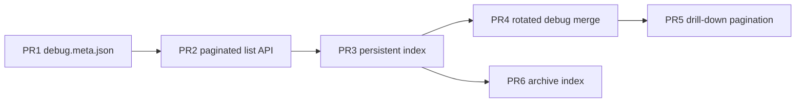

# Plan: Event log / Debug Log performance

> Keep the **Debug Log** dropdown responsive as `current.jsonl` and per-run
> `debug.jsonl` files grow. List view should open in &lt;1s; drill-down can be
> heavier but must not freeze the server.

**Status:** List fast-path + `debug.meta.json` sidecar + list pagination query (2026-07)  
**Priority:** P2 — dev UX; worsens over long sessions with many runs  
**Primary code:** `server/src/swarm/blackboard/eventLogSources.ts`, `web/src/components/EventLogPanel.tsx`

---

## Problem summary

Opening **⚙ Debug Log** calls `GET /api/v2/event-log/runs`, which builds a
segment list from three sources:

| Source | Role |
|--------|------|
| `logs/current.jsonl` | Live / recent global broadcast tail |
| `logs/events-*.jsonl.gz` | Rotated global archives (historical `run_started` index) |
| `logs/<runId>/debug.jsonl` | Per-run debug (best metadata for completed runs) |

On a busy dev machine (~49 MB `current.jsonl`, 34 per-run dirs, thousands of
archives), a naïve full-read list build took **~13s** (benchmark Jul 2026):

- **~8.8s** — full read + JSON parse of every `debug.jsonl`
- **~3.7s** — decompressing archive heads for `run_started` discovery
- **~10ms** — `current.jsonl` tail (already bounded)

Drill-down (`GET /event-log/runs/:runId`) still loads full logs — appropriate
for timeline debugging, but can be slow on 20–50 MB files.

---

## Shipped (commit `5885c48`, Jul 2026)

Implemented in `eventLogSources.ts`:

| Constant | Value | Purpose |
|----------|-------|---------|
| `CURRENT_TAIL_MAX_BYTES` | 4 MB | List uses tail of `current.jsonl` only |
| `MAX_ARCHIVE_INDEX_DECOMPRESSED_BYTES` | 512 KB | Archive index scan cap |
| `ARCHIVE_INDEX_LIMIT` | 40 | Max recent archives indexed per list build |
| `PER_RUN_INDEX_FULL_READ_MAX_BYTES` | 2 MB | Below: full parse; above: fast path |
| `PER_RUN_INDEX_HEAD_BYTES` | 256 KB | `run_started` / early state |
| `PER_RUN_INDEX_TAIL_BYTES` | 768 KB | `run_summary` / final state |
| `EVENT_LOG_LIST_CACHE_TTL_MS` | 45s | In-memory list cache |

**Large per-run debug fast path:** head + tail `deriveRunState` for bookends,
plus one streaming pass (regex event-type counts, no full JSON parse per line).

**Archive index:** `gunzipSync` uses `maxOutputLength` so we do not decompress
entire `.gz` files for a 512 KB head scan.

**UI:** Topbar dropdowns (tokens, runs, debug log) use fixed portal anchors
(`web/src/lib/topbarDropdown.ts`) so panels are not clipped by the scrollable
stats row.

**Tests:** `server/src/swarm/blackboard/eventLogSources.test.ts` (including
synthetic &gt;2 MB debug log index case).

### Remaining list-build cost

Even with the fast path, opening Debug Log still **O(number of run folders)**:
one streaming pass per large `debug.jsonl` plus archive head scans. With 100+
runs this can still be noticeable on cold cache (45s TTL).

---

## Queued work (recommended order)

### PR1 — `debug.meta.json` sidecar (highest ROI) — **Done**

Write `logs/<runId>/debug.meta.json` on `run_summary` / `run_finished` in
`createDebugSink`, and when list indexing scans a completed run.

**List builder:** prefer meta when `debug.meta.json` mtime ≥ `debug.jsonl`
mtime; fall back to head/tail/stream path if missing or stale.

**API:** `writeDebugMetaSidecar` / `tryReadDebugMetaSidecar` in `eventLogSources.ts`.

---

### PR2 — Paginated list API — **Done (server)**

```
GET /api/v2/event-log/runs?limit=10&offset=0
→ { runs, total, hasMore, offset, limit, … }
```

Client still pages 5/page for UX; server limit/offset available for heavy fleets.

---

### PR3 — Persistent on-disk index — **Done**

`logs/event-log-index.json` stores per-run list rows keyed by `debug.jsonl`
mtime. `indexPerRunDebugLogs` reuses rows when mtime matches (±2s), rescans
and upserts otherwise.

---

### PR4 — Rotated debug segment merge — **Done**

`listRotatedDebugSegments` + `readPerRunDebugLog` merge
`debug-*.jsonl(.gz)` then current `debug.jsonl` under a 12 MB budget.
Index includes rotated byte/line estimates in per-run list rows.

---

### PR5 — Drill-down record pagination — **Done**

```
GET /api/v2/event-log/runs/:runId?limit=400&beforeTs=
→ { records, totalRecords, hasMoreOlder, oldestTs, newestTs, … }
```

UI: first paint loads newest 400; **load older** prepends the previous page.

---

### PR6 — Persistent archive index — **Done**

`logs/archives-index.jsonl` appended on global log rotation (`eventLogger`)
and when list scans an unindexed archive. List prefers index hits; only
unindexed archives are gunzip-head scanned.

---

## Suggested sequence



PR1 + PR2 give the best user-visible win for the Debug Log button. PR3–PR6
harden long-session and long-run correctness.

---

## Verification

- **Unit:** extend `eventLogSources.test.ts` per PR (meta preference, pagination, segment merge).
- **Bench:** time `buildEventLogRunList` on real `logs/` before/after (scripts
  `analyze-stream-repeats-fast.mjs` is a useful reference for per-run streaming).
- **Manual:** open Debug Log with 30+ run folders; first page &lt;1s; drill-down
  on a rotated run shows full timeline.

---

## Related docs

- `docs/STATUS.md` — V2 event log feature row
- `server/src/swarm/blackboard/EventLogReaderV2.ts` — parse + `deriveRunState`
- `docs/plans/agent-activity-signaling.md` — per-run `debug.jsonl` rationale
- `docs/plans/project-growth-knowledge-graph.md` — same sidecar pattern for `.swarm/project-graph.json`