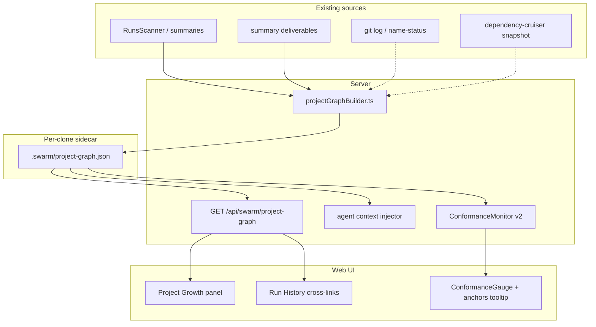

# Plan: Project growth graph + in-run knowledge graph

> Give users a **swarm-evolution** view of how a project grows across runs,
> and give both users and in-run agents a shared **project knowledge graph**
> (KG) so work stays grounded, digressions can be tied back, and the
> conformance meter reads against project reality — not transcript vibes alone.

**Status:** Complete (core) — PR1–PR7 shipped (Jul 2026)  
**Priority:** P2 — observability + agent quality; compounds with every run  
**Primary code:** `server/src/services/RunsScanner.ts`, `server/src/swarm/blackboard/summary.ts`, `server/src/services/ConformanceMonitor.ts`, `web/src/components/SystemWrapper.tsx`, `server/src/swarm/blackboard/brainOverseer/dataPipeline.ts`

**Related:** `docs/plans/event-log-performance.md` (meta sidecars pattern), `docs/ARCHITECTURE-VISION.md` (Brain cross-run librarian), postmortem `docs/postmortems/run-94224a3e.md` (grounding / expectedFiles)

---

## Problem summary

Today ollama_swarm records rich per-run artifacts but does not connect them
into a project-level mental model:

| Signal today | Where it lives | Gap |
|--------------|----------------|-----|
| Per-run deliverables (`created` / `modified` paths) | `logs/<runId>/summary*.json` | No cross-run graph; user sees a flat run list |
| Clone / parent path | `RunConfig.clonePath`, `GET /api/swarm/runs?parentPath=` | History is chronological, not structural |
| Conformance gauge | `ConformanceMonitor` → `conformance_sample` | Grades transcript vs **directive text only** |
| Embedding drift | `EmbeddingDriftMonitor` → `drift_sample` | Same — semantic distance to directive, not project |
| Agent grounding | `expectedFiles`, contract criteria, mission | Per-run snapshot; no memory of prior runs on this clone |
| Brain cross-run memory | `dataPipeline.ts` summaries + `current.jsonl` | Pattern stats, not a navigable project map |

**User pain:** Hard to see *how* a clone evolved (which files/modules accumulated
changes across runs), which runs touched the same areas, or whether the current
run is wandering into unrelated parts of the tree.

**Agent pain:** Workers and planners lack a compact "you are here" map of the
project. Legitimate exploration can look like drift to the conformance gauge;
real drift is hard to recover from because nothing points agents back to
relevant prior deliverables or module boundaries.

**Conformance pain:** A run can score 80+ on-topic while editing files unrelated
to the directive, or score low during necessary refactoring that still serves
the mission. The gauge needs **project anchors**, not just directive wording.

---

## Design goals

1. **Swarm evolution (user UX)** — timeline + graph of runs and files for a
   `parentPath` / clone, built from existing summaries (no new instrumentation
   required for v1).
2. **Project KG (shared)** — one canonical graph per clone/workspace, readable
   by UI and injectable into agent context at run start + on drift events.
3. **Conformance grounding** — grade recent work against directive **and**
   graph anchors (mission files, contract scope, prior deliverables on touched
   paths).
4. **Digression recovery** — when conformance/drift drops, surface nearest
   graph nodes + suggested tie-back actions (files to reconcile, prior run
   summaries).
5. **Incremental cost** — v1 is summary-only; optional git/structure enrich
   layers are additive sidecars, same pattern as `debug.meta.json`.

---

## Graph types (scope)

Three graph families were evaluated for OSS fit. This plan uses **all three**
as layers, not alternatives:

| Layer | Source | Primary audience | Embed in SPA? |
|-------|--------|------------------|---------------|
| **L1 — Swarm evolution** | Run summaries + deliverables | User, Brain | Yes (Reagraph / treemap) |
| **L2 — Git evolution** | `git log` on `clonePath` | User (historical) | Yes (repo-visualizer JSON) |
| **L3 — Code structure** | import/call graph (dependency-cruiser, madge) | Agents + conformance | Snapshot JSON; viz optional |

**License notes (Jul 2026):** prefer **Reagraph** (MIT) for force graphs;
**repo-visualizer** analyzer for git timeline JSON; **dependency-cruiser** for
structure. Avoid embedding **GitNexus** (PolyForm Noncommercial) and **Gource**
(not SPA-friendly) in the product UI.

---

## Canonical data model

### Node kinds

```typescript
type ProjectGraphNodeKind =
  | "workspace"      // parentPath or clone root
  | "run"            // one swarm run
  | "file"           // repo-relative path
  | "module"         // directory or dependency-cruiser module (L3)
  | "agent"          // optional: which agent touched what (L1 enrich)
  | "directive"      // frozen user intent for a run
  | "contract"       // exit contract / mission anchor (L1 enrich)
```

### Edge kinds

```typescript
type ProjectGraphEdgeKind =
  | "run_on_workspace"     // run → workspace
  | "created"              // run → file
  | "modified"             // run → file
  | "same_file_across_runs"// file(run A) → file(run B) temporal chain
  | "depends_on"           // module → module (L3)
  | "scoped_by"            // run → contract / directive
  | "recovered_via"        // drift event → suggested file nodes (runtime)
```

### Sidecar file (per clone)

Written at run end (housekeeper or summary builder), merged incrementally:

```
<clonePath>/.swarm/project-graph.json
```

```json
{
  "version": 1,
  "workspacePath": "/path/to/clone",
  "updatedAt": 0,
  "nodes": [{ "id": "run:abc", "kind": "run", "runId": "abc", "startedAt": 0, "preset": "blackboard", "stopReason": "completed" }],
  "edges": [{ "from": "run:abc", "to": "file:src/foo.ts", "kind": "modified" }],
  "anchors": {
    "missionFiles": ["README.md", "docs/STATUS.md"],
    "hotFiles": [{ "path": "src/foo.ts", "runCount": 3, "lastRunId": "abc" }],
    "modules": []
  },
  "stats": { "runCount": 12, "fileCount": 84 }
}
```

**List/build fast path:** mirror `debug.meta.json` — graph merge is O(deliverables
for this run), not O(all runs). Full rebuild API remains for backfill.

**Gitignored:** add `<clonePath>/.swarm/` to clone-side expectations (or document
as optional tracked artifact only when user opts in). Default: sidecar lives
next to `blackboard-state.json` — operational, not committed to user's repo.

---

## Architecture



---

## User experience (swarm evolution)

### Entry points

| Surface | Behavior |
|---------|----------|
| **SystemWrapper sidebar** | New "Project growth" nav item when `parentPath` is known |
| **Run History dropdown** | "View growth graph" link; file rows link to graph node highlight |
| **`/growth?path=<cloneOrParent>`** | Full-page graph + timeline (mirrors `/review` pattern) |

### Views (phased)

1. **Timeline strip** — runs ordered by `startedAt`, width = `filesChanged` or deliverable count, color = `stopReason`.
2. **Bipartite run↔file graph** — runs as one partition, files as another; edges = created/modified.
3. **File heatmap** — treemap or bar: files sized by cross-run touch count (from `anchors.hotFiles`).
4. **Drill-down** — click run node → existing history modal; click file → list of runs that touched it.

### API sketch

```
GET /api/swarm/project-graph?parentPath=...&clonePath=...&refresh=false
→ {
    workspacePath,
    graph: { nodes, edges },
    anchors,
    stats,
    source: "sidecar" | "rebuilt",
    stale: boolean
  }
```

Query rules align with `GET /api/swarm/runs`: respect `parentPath`, discover
summaries under `logs/<runId>/`, prefer sidecar when `updatedAt` covers latest
known run.

---

## In-run knowledge graph (agents)

### When to inject

| Hook | Payload slice | Purpose |
|------|---------------|---------|
| **Run start** (planner + first worker turn) | `anchors` + last 3 runs' deliverables on overlapping files | Situational awareness |
| **Per worker context** (`buildContext.worker.ts` / server pipeline) | Module neighborhood for files in current todo | Local grounding |
| **On `drift_sample` / low conformance** | `recoverySlice`: nearest hot files, prior run summaries for touched paths | Tie-back |
| **Brain analysis** | Full graph stats | Cross-run librarian queries |

### Context format (prompt-safe, token-bounded)

```
## Project map (swarm KG)
Workspace: <clonePath>
Mission anchors: README.md, docs/STATUS.md
Recently active files (cross-run): src/foo.ts (3 runs), web/App.tsx (2 runs)
This run's scope so far: modified src/foo.ts, created docs/plan.md
Prior work on src/foo.ts: run d3a99661 — "refactor event log"; run 94224a3e — "fix grounding"

Stay within directive AND prefer extending existing modules over new islands.
If exploring, link new code back to anchors before finishing.
```

**Token budget:** cap ~1.5k chars for worker injection; planner may receive 3k.
Use `hotFiles` ranking: `runCount * recencyWeight`.

### Recovery playbook (runtime)

When `smoothedScore < 40` (conformance) **or** `drift_sample.similarity < 40`
for two consecutive polls:

1. Emit `grounding_hint` SwarmEvent (new, optional) with `{ suggestedPaths[], priorRunIds[], reason }`.
2. UI: Conformance tooltip shows "off-graph edits: `src/unrelated.ts`" when
   recent commits/deliverables ∩ graph anchors = ∅.
3. Optional auto-amend: Brain or planner loop receives recovery slice on next
   turn (feature-flagged).

---

## Conformance meter integration

### Today

- `ConformanceMonitor` (`server/src/services/ConformanceMonitor.ts`): LLM grades
  transcript excerpt vs directive string.
- `EmbeddingDriftMonitor`: cosine similarity directive ↔ excerpt.
- UI: `IdentityStrip.tsx` `ConformanceGauge` sparkline + tooltips.

### Target (v2 grading prompt)

Add **project anchors** to the grader context:

```
Directive: "..."
Project anchors (files/modules in scope): mission: README.md; hot: src/foo.ts; contract files: ...
Recent file activity this run: modified src/foo.ts
Transcript excerpt: ...
```

Scoring rubric adjustment:

| Score band | Meaning (revised) |
|------------|-------------------|
| 80–100 | Transcript + file activity align with directive **and** anchors / hot modules |
| 50–79 | On-topic discussion but touching peripheral or new areas — acceptable exploration |
| 20–49 | Activity drifting to low-relevance files; recovery hints warranted |
| 0–19 | Clear digression — file edits unrelated to directive and anchors |

### New event fields (backward compatible)

Extend `conformance_sample` / `drift_sample` optionally:

```typescript
{
  anchorOverlap?: number;      // 0–100: % of recent deliverables on hot/contract paths
  offGraphPaths?: string[];    // files touched but not in anchor neighborhood
  recoverySuggested?: boolean;
}
```

UI: sparkline unchanged; tooltip gains anchor overlap + off-graph file list.

### Independent signals (keep both)

| Signal | Detects |
|--------|---------|
| LLM-judge + anchors | Intent + scope violations |
| Embedding drift | Semantic wander in language |
| Anchor overlap (deterministic) | File-level digression without LLM cost |

Disagreement (high conformance, low anchor overlap) → show "exploring new files"
rather than false green.

---

## Queued work (recommended order)

### PR1 — Swarm evolution graph from summaries only (L1)

**Goal:** User-visible growth graph with zero clone instrumentation.

**Server:**

- `server/src/swarm/projectGraphBuilder.ts` — build `{ nodes, edges, stats }`
  from `scanForRunDigests` / `readAllRunSummaries` + `deliverables[]`.
- `GET /api/swarm/project-graph` in `server/src/routes/swarm.ts`.
- Unit tests: synthetic summaries → expected edges (`created`, `modified`,
  `same_file_across_runs`).

**Web:**

- `web/src/components/ProjectGrowthPanel.tsx` — timeline + simple force graph.
- Wire sidebar in `SystemWrapper.tsx`; link from `RunHistory.tsx`.
- Route `/growth` in `App.tsx` (query `path=`).

**Library:** add **Reagraph** (or lightweight d3-force if bundle size blocks).

**Effort:** ~1–2 PRs · **Impact:** immediate user visibility.

---

### PR2 — `project-graph.json` sidecar + incremental merge

**Goal:** O(deliverables) updates at run end; fast API read.

**Touchpoints:**

- `server/src/swarm/blackboard/summary.ts` / run housekeeper — call
  `mergeRunIntoProjectGraph(clonePath, runSummary)` after summary write.
- API prefers sidecar; `?refresh=true` rebuilds from summaries.
- Backfill script: `server/scripts/backfill-project-graph.mjs` (optional).

**Effort:** ~1 PR · **Impact:** scales to many runs; enables agent injection.

---

### PR3 — Agent context injection + recovery hints

**Goal:** Planners/workers see project map; drift triggers tie-back slice.

**Touchpoints:**

- `server/src/swarm/blackboard/prompts/planner.ts` — optional KG section.
- Worker pipeline context builder (blackboard `WorkerPipeline` / grounding path).
- New optional `grounding_hint` event; `applyEvent.ts` + `wsProtocol.ts` if persisted.
- Feature flag: `RunConfig.projectGraphContext?: boolean` (default on for blackboard).

**Effort:** ~1–2 PRs · **Impact:** reduces digression; improves run quality.

---

### PR4 — ConformanceMonitor v2 + UI anchor tooltip

**Goal:** Sensible gauge readings when agents touch unrelated files.

**Touchpoints:**

- `ConformanceMonitor.ts` — load graph anchors; extend `gradeWithOllama` prompt.
- `computeAnchorOverlap(recentDeliverables, anchors)` — deterministic helper.
- `IdentityStrip.tsx` — tooltip fields for `anchorOverlap`, `offGraphPaths`.
- Tests: mock graph + deliverables → score reason mentions scope.

**Effort:** ~1 PR · **Impact:** user trust in conformance gauge.

---

### PR5 — Git evolution enrich (L2, optional)

**Goal:** Commit-level timeline alongside swarm runs.

- Run `repo-visualizer` analyzer (or lightweight `git log --numstat`) on
  `clonePath` when `.git` exists.
- Cache `logs/.swarm/git-history.json` or store in sidecar `gitLayer`.
- UI toggle: "Git timeline" vs "Swarm runs".

**Effort:** ~1 PR · **Impact:** nicer narrative for mature repos.

---

### PR6 — Code structure snapshot (L3, optional)

**Goal:** Module boundaries for conformance + agent neighborhood.

- `dependency-cruiser` or `madge` CLI on demand / at run end (throttled).
- Add `module` nodes + `depends_on` edges to sidecar.
- Conformance: "edits outside module neighborhood of contract files" penalized.

**Effort:** ~1–2 PRs · **Impact:** best grounding for large codebases.

---

### PR7 — Brain librarian graph queries

**Goal:** Brain reasons over graph, not just summary aggregates.

**Touchpoints:**

- `brainOverseer/dataPipeline.ts` — load `project-graph.json`.
- Prompt templates: "which files are over-touched?", "suggest next run scope".

**Effort:** ~1 PR · **Impact:** smarter run provisioning.

---

## Verification

| Check | Command / action |
|-------|------------------|
| Graph builder unit tests | `pnpm --filter server test projectGraph` |
| API contract | `curl "/api/swarm/project-graph?parentPath=..."` returns nodes ≥ run count |
| UI smoke | Open `/growth?path=`, timeline renders 10+ runs from fixture summaries |
| Sidecar merge | End run → `.swarm/project-graph.json` mtime updates; node count +1 |
| Agent injection | Planner prompt contains `Project map` when flag on |
| Conformance v2 | Mock off-graph edit → `anchorOverlap` low, tooltip lists paths |
| CI | `pnpm verify-ci` green |

**Fixture strategy:** extend `eval/fixtures` or `server/src/swarm/blackboard/*.test.ts`
with multi-run summary JSONs sharing deliverable paths.

---

## Non-goals (v1)

- Real-time graph updates during a run (batch at run end is enough for v1).
- Replacing `expectedFiles` / CAS grounding — KG complements, not supersedes.
- Committing graph sidecars into user's git repo by default.
- Full IDE-grade code intelligence (LSP, call graph precision).

---

## Open questions

1. **Sidecar location:** `.swarm/project-graph.json` inside clone vs `logs/.swarm-graph-<hash>.json` under parent?
   - *Lean:* clone-local `.swarm/` matches blackboard state; parent-level index for multi-clone parents in PR2+.
2. **Default on for agent injection?** Blackboard yes; discussion-only presets no.
3. **Reagraph bundle size** — if >200kb gzipped, ship timeline-only v1 and lazy-load graph.

---

## Overhead assessment

**Short answer:** L1 (summary-only graph + UI) is **low overhead** if kept
read-only and on-demand. L2–L3 and in-run injection add **moderate** cost;
conformance v2 adds **one optional LLM context block** per poll (not extra
calls). Nothing here needs to sit on the hot path of commits, WS broadcast, or
runner loops.

### By dimension

| Dimension | L1 (PR1–2) | L3 agent inject (PR3) | L4 conformance (PR4) | L5–L6 enrich |
|-----------|------------|------------------------|-------------------------|--------------|
| **Server CPU** | One graph build per API open (cacheable); O(runs × deliverables) | +1–2 ms prompt assembly per worker turn | +~200 tokens in existing grader prompt | Git/dep-cruiser: seconds at run end |
| **Server memory** | ~50–500 KB JSON per workspace in cache | Slice strings only; no graph in runner heap | Reads sidecar once per poll (or cached) | Structure snapshot can be 1–5 MB |
| **Disk** | Optional sidecar ~10–200 KB/clone | Same sidecar | Same | +git/structure cache files |
| **Network (UI)** | One REST fetch when panel opens | None extra | WS fields optional | On-demand only |
| **Web bundle** | **+0** if timeline-only; **+150–400 KB** if Reagraph eager-loaded | None | Tooltip fields only | Lazy route chunk |
| **Run token budget** | None | **+300–1500 chars/turn** when enabled | None (grader already runs) | None |
| **Run latency** | None on runner | Negligible string concat | None | Run-end hook +0.5–5s |
| **Dev / CI** | New module + tests; no changes to runners | Prompt diff review | Monitor opt-in subclass | Optional CLI deps |

### Compared to existing costs

- **ConformanceMonitor** already costs ~1 LLM call / 90s during a run.
  PR4 widens the prompt; it does **not** add another poll loop.
- **GET /api/swarm/runs** already scans parents with a **30s cache**
  (`RunsScanner`). PR1 can **reuse the same scan** or read sidecar — not
  duplicate full filesystem walks on every page load.
- **Debug log fast-path** lesson applies: never block list/open on unbounded
  I/O. Graph API must have TTL cache + sidecar fast path.

### When overhead becomes significant (avoid in v1)

- Building L3 import graphs **during** a run (do at run end or manual refresh).
- Injecting full graph JSON into **every** worker turn (use ranked `hotFiles` slice).
- Rendering 500+ node force graphs without level-of-detail (cap nodes, cluster by directory).
- Rebuilding graph from all summaries on **every** conformance poll.

---

## Modular architecture (protect existing code)

Design principle: **new vertical slice, old paths unchanged by default.** Mirror
how `ConformanceMonitor` and `EmbeddingDriftMonitor` attach optionally on
`ActiveRun` without modifying runners.

### Package boundaries

```
server/src/projectGraph/          # NEW — zero imports from blackboard runners
  ├── types.ts                    # nodes, edges, anchors (shared shape)
  ├── buildFromSummaries.ts       # pure: summaries → graph
  ├── mergeSidecar.ts             # pure: graph + one RunSummary → graph
  ├── readSidecar.ts              # I/O only
  ├── formatAgentSlice.ts         # pure: graph → prompt string
  ├── anchorOverlap.ts            # pure: deliverables vs anchors
  └── projectGraph.test.ts

server/src/routes/projectGraph.ts # NEW route module; register in swarm.ts

web/src/features/projectGrowth/   # NEW — lazy route
  ├── ProjectGrowthPage.tsx
  ├── RunTimeline.tsx             # no graph lib
  └── ForceGraph.lazy.tsx         # optional Reagraph chunk
```

**Rules:**

1. **No edits inside `WorkerPipeline.ts` / `Orchestrator.ts` runner loop** until
   PR3 — and then only via a single `appendProjectContext(slice)` hook behind a flag.
2. **Conformance v2** = new file `ConformanceMonitorAnchored.ts` **or** optional
   `anchors?: ProjectAnchors` on existing opts — old behavior when `anchors` absent.
3. **UI** = new route + sidebar item; `SystemWrapper` gets one import + conditional
   nav link, not a rewrite.
4. **Shared types** live in `server/src/projectGraph/types.ts`; web duplicates a
   slim `ProjectGraphResponse` in `web/src/types.ts` (existing pattern for API shapes).

### Feature gates (three layers)

| Gate | Scope | Default | Kill switch |
|------|-------|---------|-------------|
| `PROJECT_GRAPH_ENABLED` | Server: register route, run-end merge | `true` after PR2 | env `false` → API 404, no sidecar writes |
| `projectGraphContext` on `RunConfig` | Per-run agent injection | `false` until PR3 proven | omit field |
| `PROJECT_GRAPH_VIZ` | Web: load Reagraph chunk | `false` in PR1; timeline only | env / `?viz=0` |

Server env pattern already exists (`COUNCIL_CONTRACT_ENABLED`, `SWARM_*` in
`config.ts`). Add two vars there — do not hardcode behavior in runners.

### Sidecar write isolation

Run-end merge runs in **housekeeper / summary path**, same as deliverables
extraction today:

```typescript
// Pseudocode — fire-and-forget, never throw into summary build
void mergeProjectGraphSidecar(clonePath, summary).catch((err) =>
  console.warn("[projectGraph] sidecar merge failed:", err),
);
```

If merge fails: run still completes; graph API falls back to rebuild-from-summaries.

### API contract stability

- New route only: `GET /api/swarm/project-graph` — no changes to
  `GET /api/swarm/runs` response shape.
- New optional WS fields on `conformance_sample` — old clients ignore.
- No new required `RunConfig` fields.

---

## Risk analysis

| ID | Risk | Likelihood | Impact | Mitigation |
|----|------|------------|--------|------------|
| R1 | Graph build slow with 100+ runs (cold API) | Medium | Medium | Sidecar (PR2), 30–60s TTL cache, paginate/limit nodes in v1 |
| R2 | Reagraph bloats main bundle | High if eager | Medium | Timeline-only PR1; `React.lazy` + separate chunk for force graph |
| R3 | Agent prompt bloat → quality/cost regression | Medium | High | Token cap on slice; flag off by default; A/B on eval fixtures |
| R4 | Conformance v2 false negatives (refactors penalized) | Medium | Medium | Anchor overlap as **separate** signal; don't replace LLM score; tooltip explains disagreement |
| R5 | Sidecar corrupt / partial write | Low | Low | Atomic write (tmp + rename); version field; rebuild API |
| R6 | Wrong clone path → empty or merged graphs | Medium | Medium | Key sidecar by resolved `clonePath`; validate against summary `localPath` |
| R7 | Touching runner hot path → commit regressions | Medium | High | PR1–2 read-only; PR3 only appends prompt section; no CAS/parser changes |
| R8 | dependency-cruiser / git subprocess hangs run end | Medium | High | PR5–6 optional, timeout 30s, async background job, never await in summary critical path |
| R9 | User repo pollution (`.swarm/` committed) | Low | Low | Document; add to `.gitignore` template in AGENT-GUIDE; sidecar outside user tree option |
| R10 | Brain / librarian bad recommendations from stale graph | Low | Medium | `updatedAt` + `stale` flag in API; Brain prompt says "snapshot as of …" |
| R11 | Privacy: graph exposes paths across shared parent | Low | Medium | Same parent scoping as runs list; no `includeOtherParents` on graph API |
| R12 | CI flakiness from new CLI deps | Medium | Low | L2–L6 behind optional devDeps; CI tests use fixtures only |

### Blast radius by PR

| PR | Touches runner? | Touches WS protocol? | Touches conformance? | Rollback |
|----|-----------------|----------------------|----------------------|----------|
| PR1 | No | No | No | Delete route + UI route |
| PR2 | No (housekeeper only) | No | No | Disable env; delete sidecars |
| PR3 | Yes (prompt append) | Optional `grounding_hint` | No | `projectGraphContext: false` |
| PR4 | No | Optional fields | Yes (prompt only) | Omit `anchors` opt |
| PR5–7 | No | No | Optional | Env off |

**Highest-risk PR is PR3** (agent behavior). Ship PR1 → PR2 → PR4 (read-only
signals) before turning on PR3 in production.

---

## Recommended implementation strategy

### Phase A — Prove value with zero runner risk (PR1)

1. Implement `buildFromSummaries` as **pure function** with fixture tests.
2. New route delegates to `RunsScanner` digest list + load full summaries for
   deliverables only (or extend digest type in a backward-compatible optional field).
3. UI: **timeline + table only** — no graph library.
4. Cache response in-memory keyed by `parentPath` (45s TTL, match event log).

**Exit criteria:** 50-run workspace opens in &lt;500ms warm / &lt;2s cold; CI green;
no existing test failures.

### Phase B — Persist without blocking runs (PR2)

1. `mergeSidecar` pure function + atomic write helper.
2. Hook from run housekeeper **after** `summary.json` is written.
3. API: prefer sidecar; `?refresh=true` rebuilds.

**Exit criteria:** Kill switch `PROJECT_GRAPH_ENABLED=false` leaves all prior
behavior identical; sidecar failure does not fail runs.

### Phase C — Observability before steering (PR4 before PR3)

1. `anchorOverlap` deterministic helper from live `finalGitStatus` / recent
   deliverables (no sidecar required for first cut).
2. Extend conformance emit with optional fields; UI tooltip only.
3. Optional `ConformanceMonitor` anchors from sidecar when present.

**Why before PR3:** Users gain trustworthy gauge readings without changing
agent behavior — easier to validate and revert.

### Phase D — Agent grounding (PR3, gated)

1. `formatAgentSlice(graph, { maxChars: 1500 })` pure function.
2. Single injection point in planner seed + worker context builder.
3. Default **off**; enable on blackboard preset when `userDirective` non-empty.
4. Eval: compare fixture run outcomes with/without slice on 2–3 golden tasks.

### Phase E — Enrichment (PR5–7, optional products)

Only after A–D stable. Each is a standalone PR with subprocess timeout and
env gate.

### Testing strategy (modular)

| Layer | Test type | Isolation |
|-------|-----------|-----------|
| `buildFromSummaries` | Unit, golden JSON | No fs |
| `mergeSidecar` | Unit | Tmp dir |
| Route | Integration | Mock scanner |
| UI timeline | Component | Mock fetch |
| Conformance anchors | Unit | Mock graph |
| Agent injection | Snapshot of prompt string | No LLM |

### Code review checklist (every PR)

- [ ] Feature can be disabled without code deploy (env or absent opt-in field)
- [ ] No new `throw` in run-end or commit paths
- [ ] No new required fields on existing API responses
- [ ] Pure logic extracted from I/O (testable without server boot)
- [ ] Node cap / char cap documented in constants

---

## Related docs

- `docs/plans/event-log-performance.md` — sidecar + index patterns
- `docs/ARCHITECTURE-VISION.md` — Brain librarian / cross-run memory
- `docs/postmortems/run-94224a3e.md` — grounding failures
- `server/src/swarm/blackboard/summary.ts` — `deliverables` extraction
- `server/src/services/ConformanceMonitor.ts` — current gauge behavior

**Last updated:** 2026-07-08 (overhead + risk + modular strategy)