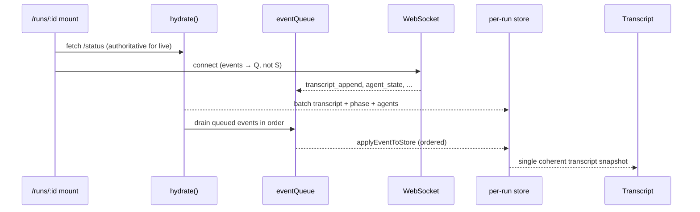

# Plan: Run-start stability (hydrate races, phase corruption, transcript dedup)

> Addresses flickering/hidden transcript messages, frozen agent sidebar, and
> wrong terminal phase immediately after starting a run from Setup → `/runs/:id`.

**Status:** Complete (PR1 ✅ PR2 ✅ PR3 ✅ PR4 ✅)  
**Priority:** P1 — user-visible on every new run  
**Estimated effort:** 3–4 focused PRs (~1–2 days total)

---

## Problem summary

When a user starts a swarm, the UI navigates to `/runs/:runId` and mounts
`SwarmStoreProvider`. Several subsystems race:

1. REST `/api/swarm/runs/:id/status` hydrate (async)
2. Per-run WebSocket subscription (sync open, events immediate)
3. Client `run_started` → `resetForNewRun` (prepends RUN-START divider)
4. Server `runner.start()` → transcript appends (RUN-START, pipeline, agents)
5. Transcript virtualizer remeasure + auto-scroll

Observed symptoms:

- Transcript **flickers** and messages appear **hidden** until scroll/resize
- Agent sidebar **freezes** (no status updates) while transcript may still grow
- Run looks **stopped/completed** seconds after start

Root causes identified in code review (2026-07):

| # | Root cause | Primary file(s) |
|---|------------|-----------------|
| A | `SwarmStoreProvider` opens WS **without** hydrating first; no event buffer (singleton hook has this — Task #120) | `SwarmStoreProvider.tsx` |
| B | Fallback hydrate (`/runs` + `run-summary`) runs **even when `/status` succeeded**; `run-summary` 404 → `setPhase("stopped")` | `SwarmStoreProvider.tsx` |
| C | `hydrateTranscriptEntries` only dedupes by `id`; `appendEntry` has richer dedup (RUN-START text, seeds, skips) | `store.ts` |
| D | No automated test covers real run-start transcript order / live phase | `scripts/run-test.mjs` |

Recent Transcript.tsx fixes (id-keyed DOM refs, coalesced measure) reduce **symptom D's UI jitter** but do not fix **A/B/C** store-layer races.

---

## Target end state



**Invariants after this plan:**

1. Live run phase is never set to `stopped`/`completed` by history fallback.
2. WS events during hydrate are buffered and applied **after** snapshot merge.
3. Snapshot merge and live append share **one** transcript merge function.
4. `run-test --live-smoke` catches regressions without a full LLM run (optional mock/minimal preset).

---

## PR plan (dependency order)

```
PR1 unified merge helper (store.ts)
  ↓
PR2 provider hydrate hardening (SwarmStoreProvider.tsx) — uses PR1
  ↓
PR3 run-test live-smoke + update verify scripts — validates PR2
  ↓
PR4 transcript virtualizer tuning (optional, only if PR1–3 insufficient)
```

PR1 and PR2 are **required**. PR3 is **required for regression safety**. PR4 is **optional polish**.

---

## PR1 — Unified transcript merge helper

### Goal

Single code path for adding transcript entries whether they arrive via WS
(`appendEntry`), REST hydrate (`hydrateTranscriptEntries`), or review reload.

### Changes

**`web/src/state/store.ts`**

1. Extract pure function:

   ```ts
   export function mergeTranscriptEntry(
     state: Pick<SwarmStore, "transcript" | "streaming" | "streamingMeta">,
     entry: TranscriptEntry,
   ): Partial<Pick<SwarmStore, "transcript" | "streaming" | "streamingMeta">> | null
   ```

   Move existing `appendEntry` body logic into this function unchanged
   (RUN-START dedup, seed dedup, worker_skip dedup, streaming handoff,
   divider-to-index-0 reorder).

2. Refactor `appendEntry` to call `mergeTranscriptEntry` inside `set()`.

3. Refactor `hydrateTranscriptEntries` to:

   ```ts
   hydrateTranscriptEntries: (entries) => set((s) => {
     let acc = { transcript: s.transcript, streaming: s.streaming, streamingMeta: s.streamingMeta };
     for (const e of entries) {
       const delta = mergeTranscriptEntry(acc, e);
       if (delta) acc = { ...acc, ...delta };
     }
     return acc;
   })
   ```

4. Export `mergeTranscriptEntry` for unit tests.

**`web/src/state/store.test.ts`** (new cases)

| Test | Assert |
|------|--------|
| hydrate + append same RUN-START runId | single divider |
| hydrate duplicate seed prefix | second dropped |
| hydrate then append out-of-order ids | correct final order (append order after batch) |
| streaming handoff on hydrate path | N/A — hydrate entries are never streaming |

**`web/src/state/applyEvent.test.ts`**

- Update history roundtrip test to use `hydrateTranscriptEntries` instead of
  per-entry `appendEntry` loop (mirrors production).

### Acceptance criteria

- [ ] All existing `store.test.ts` / `applyEvent.test.ts` pass
- [ ] New dedup parity tests pass
- [ ] No behavior change for steady-state WS `transcript_append` (one entry at a time)

### Risk

Low — refactor with tests; logic is moved, not rewritten.

---

## PR2 — SwarmStoreProvider hydrate hardening

### Goal

Fix live run phase corruption and WS/hydrate ordering race on `/runs/:id`.

### Changes

**`web/src/state/SwarmStoreProvider.tsx`**

#### 2a. Hydration event buffer (mirror Task #120)

Per-provider instance (not module-global — each `runId` gets its own):

```ts
let isHydrating = true;
const pendingEvents: SwarmEvent[] = [];

function dispatchDuringHydrate(ev: SwarmEvent) {
  if (isHydrating) { pendingEvents.push(ev); return; }
  applyEventToStore(ev, storeRef.current.getState());
}

// In hydrate() finally:
isHydrating = false;
while (pendingEvents.length) {
  const ev = pendingEvents.shift();
  if (ev) applyEventToStore(ev, storeRef.current.getState());
}
```

- Open WS **after** `await hydrate()` completes, **or** keep parallel open but
  route all `onmessage` through `dispatchDuringHydrate` until `isHydrating=false`.
- Recommended: **parallel OK with buffer** (faster agent updates once drained).

#### 2b. Gate history fallback

Track hydrate outcome:

```ts
let statusHydrateOk = false;
// inside if (res.ok) { ... statusHydrateOk = true; }
```

Only enter `/runs` + `run-summary` fallback when:

```ts
if (!cancelled && !statusHydrateOk) { /* existing fallback */ }
```

**Never** call `setPhase("stopped")` in fallback unless:

- `run-summary` returned OK **and** `summary.stopReason` is set, OR
- `/status` explicitly returned terminal phase

Remove these dangerous paths for live runs:

- `run-summary` 404 → `setPhase("stopped")`  ❌
- `/runs` list miss → `setPhase("stopped")` when `/status` never ran  → use `spawning` + WS instead

#### 2c. Divider injection simplification

After PR1 unified merge:

- Remove manual `setState({ transcript: [divider, ...] })` blocks in Provider
  when `/status` already includes transcript entries.
- Keep **one** synthetic divider inject only when **both** `/status` and WS
  have empty transcript after hydrate+drain (edge: ultra-fast navigation).

#### 2d. Terminal WS guard tightening

Current guard drops `agent_state` when `phase === stopped`. Add:

```ts
const liveBySnap = statusHydrateOk && !hasSnapCompleted;
if ((agent_state|swarm_state) && !liveBySnap && (terminal phase || summary)) return;
```

So a wrongly-set `stopped` from old fallback can't permanently block updates
once `/status` says the run is live.

**`web/src/hooks/useSwarmSocket.ts`**

- No change required (already no-ops under Provider).
- Optional: extract shared `createHydrationGate()` helper used by both socket
  hook and Provider to avoid drift.

### Tests

**`web/src/state/SwarmStoreProvider.test.ts`** (new file, or extend applyEvent tests)

Use mocked `fetch` + fake WS:

| Scenario | Assert |
|----------|--------|
| `/status` OK (phase=planning) + `run-summary` 404 | phase stays `planning` |
| WS `transcript_append` before hydrate completes | final order matches server order after drain |
| `/status` fails, `run-summary` OK with stopReason | phase terminal, WS agent_state blocked |
| `/status` OK, WS `run_started` during hydrate | single RUN-START divider |

Implementation note: Provider tests may use `@testing-library/react` +
`renderHook` or a thin extract of `hydrate()` into testable module
`swarmStoreHydrate.ts` — prefer extract if Provider test is heavy.

### Acceptance criteria

- [ ] Start run from Setup → sidebar agents update within first planning phase
- [ ] Phase badge never flips to Stopped while run is active on server
- [ ] Refresh mid-run: transcript order matches `/status` snapshot + live tail
- [ ] Historical `/runs/:id` for completed run still loads via fallback

### Risk

Medium — Provider is critical path; requires manual + automated validation.
Feature-flag not needed; behavior is strictly more correct for live runs.

---

## PR3 — Run-test live-smoke + script cleanup

### Goal

Automated regression for run-start invariants without manual Playwright tours.

### Changes

**`scripts/run-test.mjs`**

Add flag: `--live-smoke`

Flow:

1. Reuse existing dev-server boot + API health checks.
2. `POST /api/swarm/start` with **minimal** payload:
   - `preset: "baseline"` or mock-friendly preset (no API keys if possible)
   - **If keys required:** skip with `warn` unless `RUN_TEST_LIVE=1`
   - Short `wallClockCapMs` / `tokenBudget` so run dies quickly
3. Playwright navigates to `/runs/:runId` from response.
4. Poll up to 30s:
   - `phase` not in `stopped|completed|failed` for first 10s (or until cap kills it)
   - `transcript.length >= 1`
   - exactly one RUN-START divider (by text match)
   - no duplicate seed-prefix lines
5. Capture `playwright/screenshots/03-run-started.png` + `logs/live-smoke.json`

Env knobs:

| Var | Default | Purpose |
|-----|---------|---------|
| `RUN_TEST_LIVE` | `0` | Gate real LLM start |
| `RUN_TEST_PRESET` | `baseline` | Preset for smoke |
| `RUN_TEST_START_TIMEOUT_MS` | `30000` | Poll budget |

**`package.json`**

```json
"run-test:live": "node scripts/run-test.mjs --live-smoke"
```

**`scripts/verify-6-issues.mjs`**

- Mark issue #5 (hybrid sidebar) as **removed/obsolete**
- Add banner pointing to `run-test --live-smoke` for #2 and #4

**`docs/AGENT-GUIDE.md`** (short addition)

- Document `npm run run-test` vs `RUN_TEST_LIVE=1 npm run run-test -- --live-smoke`

### Acceptance criteria

- [x] `npm run run-test` still passes without keys (UI-only default)
- [ ] `RUN_TEST_LIVE=1 npm run run-test -- --live-smoke` passes in dev env with provider configured
- [x] REPORT.json includes `live-smoke` check entries

### Risk

Low for default path; live-smoke is opt-in CI job.

---

## PR4 — Transcript virtualizer tuning (optional)

Only pursue if PR1–3 leave residual flicker.

### Candidates

| Change | File | Rationale |
|--------|------|-----------|
| Reduce `overscan` 300 → 40 | `Transcript.tsx` | Less DOM churn at run start |
| Narrow `rangeExtractor` extra ±400 → ±80 | `Transcript.tsx` | Same |
| Disable virtualizer for `length < 50` | `Transcript.tsx` | Run-start lists are small; full render avoids estimate drift |
| Preserve scroll anchor on prepend | `Transcript.tsx` | If user scrolled up, prepend shouldn't jump viewport |

### Acceptance criteria

- [x] `overscan` 300 → 40, `rangeExtractor` ±400 → ±80
- [x] Plain list render when `filteredTranscript.length < 50`
- [x] Scroll anchor preserved on RUN-START prepend when user scrolled up
- [ ] Manual run-start: no visible flicker on first 20 messages
- [ ] Long-run perf: still smooth at 500+ entries (benchmark with fake gallery)

---

## Manual validation checklist (post-merge)

Run from repo root with `npm run dev`:

- [ ] **Fresh start:** Setup → Blackboard → Start → lands on `/runs/:id` < 2s
- [ ] **Transcript:** RUN-START at top; `[Pipeline]` lines visible without scroll/resize
- [ ] **Agents:** sidebar shows spawning → ready/working transitions
- [ ] **Phase badge:** not Stopped while run active
- [ ] **Latest button:** appears when scrolled up; returns to live tail
- [ ] **Mid-run refresh:** F5 on `/runs/:id` — transcript intact, order preserved
- [ ] **Completed review:** open past run from history — terminal phase, summary present
- [ ] **Concurrent:** start run A, open run B in new tab — no cross-run transcript bleed

---

## Rollout / ownership

| PR | Owner suggestion | Review focus |
|----|------------------|--------------|
| PR1 | store/state | dedup parity, no streaming regressions |
| PR2 | Provider/WS | phase logic, fallback gating |
| PR3 | tooling/CI | doesn't break default `run-test` |
| PR4 | UI perf | only if needed |

**Rollback:** PR2 is highest impact; revert Provider first if live runs break.
PR1 is safe to keep even if PR2 reverts.

---

## Out of scope (document, don't fix here)

- Cross-run transcript retention on same tab session (`resetForNewRun` keeps history)
- `appendEntry` silently dropping duplicate seed/skip messages (intentional noise reduction)
- Full E2E preset sweep (`scripts/all-presets-sweep.mjs`)
- Restoring hybrid-mode verify-6-issues checks (hybrid removed 2026-07)

---

## References

- Task #120 hydration race fix: `web/src/hooks/useSwarmSocket.ts`
- Task #37 lighter `resetForNewRun`: `web/src/state/store.ts`
- Task #171 server RUN-START sentinel: `server/src/swarm/blackboard/lifecycleRunner.ts`
- Transcript virtualizer: `web/src/components/Transcript.tsx`
- Prior verify script: `scripts/verify-6-issues.mjs`